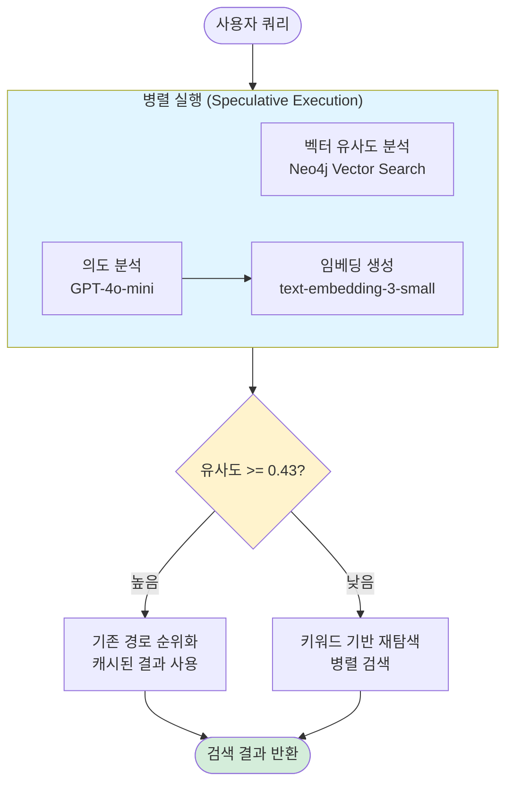
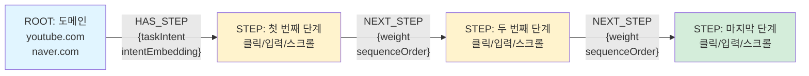

# Vowser Agent Server

**사용자 의도에 맞는 웹 탐색 경로를 반환하는 LangGraph 기반 Agent 서버**

## 프로젝트 소개

Vowser Agent Server는 사용자의 웹 탐색 패턴을 학습하고, 자연어 질의로 최적의 경로를 추천하는 지능형 서버입니다. Neo4j 그래프 데이터베이스와 LangGraph 워크플로우를 활용하여 웹 자동화를 위한 경로 분석 및 검색 기능을 제공합니다.

### 핵심 가치

- **자연어 검색**: "유튜브에서 좋아요 누르기"와 같은 자연어로 경로 검색
- **지능형 추천**: LangGraph 기반 병렬 분석으로 사용자 의도에 맞는 최적의 경로 추천
- **실시간 통신**: WebSocket 기반 양방향 실시간 데이터 교환

## 시스템 아키텍처

### LangGraph 워크플로우 구조



### 주요 최적화

1. **병렬 실행**: similarity 분석과 intent 분석을 동시에 수행하여 대기 시간 제거
2. **Speculative Execution**: 높은 유사도일 때 intent 결과를 버려 오버헤드 최소화
3. **결과 캐싱**: 중복 Neo4j 쿼리 방지로 성능 향상
4. **Non-blocking I/O**: 모든 I/O 작업을 비동기로 처리

**성능 개선**: 낮은 유사도 경로에서 500-1000ms 절약 (약 40-60% 향상)

## 빠른 시작

### 1. Conda 환경 설정

```bash
# 첫번째 방법: yaml 파일로 Conda 환경 생성
conda env create -f environment.yml
conda activate env

# 두번쨰 방법: Conda 가상환경 만들고 pip 의존성으로 설치치
conda create -n env python=3.11
conda activate env
pip install -r requirements.txt
```

### 2. 환경 변수 설정

`.env` 파일을 생성하고 다음 내용 입력하고 채워넣기:

```env
# Neo4j 설정
OPENAI_API_KEY=
GOOGLE_API_KEY=

# Neo4j 설정 - AuraDB
# Wait 60 seconds before connecting using these details,
# or login to https://console.neo4j.io to validate the Aura Instance is available
NEO4J_URI=
NEO4J_USERNAME=
NEO4J_PASSWORD=

NEO4J_DATABASE=
AURA_INSTANCEID=
AURA_INSTANCENAME=
```

### 3. FastAPI 서버 실행

```bash
uvicorn app.main:app --port 8000 --reload
```

### 주요 메시지 타입

#### 1. 경로 저장

```json
{
  "type": "save_new_path",
  "data": {
    "sessionId": "session-123",
    "taskIntent": "유튜브에서 음악 찾기",
    "domain": "youtube.com",
    "steps": [...]
  }
}
```

#### 2. 경로 검색 (LangGraph)

```json
{
  "type": "search_new_path",
  "data": {
    "query": "유튜브에서 좋아요 누르기",
    "limit": 3,
    "domain_hint": None
  }
}
```

#### 3. 인기 경로 조회

```json
{
  "type": "find_popular_paths",
  "data": {
    "domain": "naver.com",
    "limit": 10
  }
}
```

## 프로젝트 구조

```
vowser-mcp-server/
├── app/
│   ├── main.py                      # FastAPI WebSocket 서버
│   ├── models/                      # Pydantic 데이터 모델
│   │   ├── step.py                  # STEP 노드 모델
│   │   └── root.py                  # ROOT 노드 모델
│   └── services/
│       ├── langgraph_service.py     # LangGraph 워크플로우 (병렬 실행)
│       ├── neo4j_service.py         # Neo4j 그래프 DB 서비스
│       ├── embedding_service.py     # OpenAI 임베딩 (캐싱 포함함)
│       └── db_setup.py              # 벡터 인덱스 설정
├── test/
│   └── test_single.py               # WebSocket 통합 테스트
├── docs/                            # 기술 문서
└── requirements.txt                 # Python 의존성
```

## Neo4j 그래프 구조



### 노드 타입

- **ROOT**: 도메인 정보 (youtube.com, naver.com 등)
- **STEP**: 웹 페이지의 인터랙션 단계 (클릭, 입력 등)

### 관계 타입

- **HAS_STEP**: ROOT → 첫 STEP (taskIntent, intentEmbedding 포함)
- **NEXT_STEP**: STEP → STEP (순차 연결, sequenceOrder 추적)

## 기술 스택

- **FastAPI**: 비동기 웹 프레임워크
- **LangGraph**: AI 워크플로우 오케스트레이션
- **Neo4j**: 그래프 데이터베이스 (벡터 인덱스)
- **OpenAI API**: GPT-4o-mini (의도 분석), text-embedding-3-small (임베딩)
- **LangChain**: AI 통합 프레임워크

## LangGraph 성능 개선

LangGraph 적용 후 플로우 구조 변경과 캐싱으로로 오버 헤드 개선

| 경로 유형 | 기존 | 최적화 | 개선율 |
|---------|------|--------|--------|
| 높은 유사도 (>=0.43) | 7,000ms | 4,000ms | **약 43%** |
| 낮은 유사도 (<0.43) | 19,000ms | 6,000ms | **약 68%** |
| 반복 쿼리 (임베딩 캐시) | 4,000ms | 2,500ms | **약 60%** |

## 라이선스

Apache License 2.0 - 자세한 내용은 [LICENSE](LICENSE) 파일 참조

## 관련 프로젝트

- **vowser-backend**: Kotlin/Spring Boot API 게이트웨이
- **vowser-client**: Kotlin Multiplatform 클라이언트 애플리케이션
