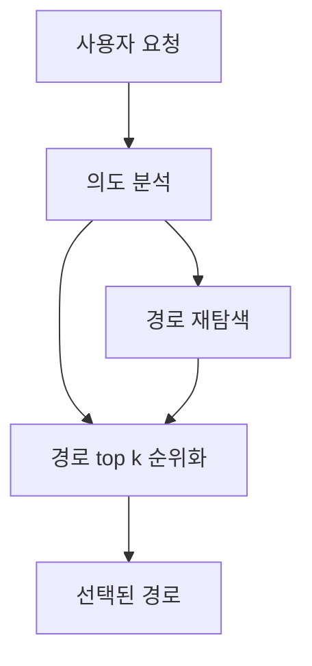

# LangGraph Integration Design

## Current State Analysis

### LangGraph Usage Status

**Current Status**: ❌ **LangGraph is NOT currently used in this project**

The project uses:
- **LangChain**: For OpenAI/Gemini LLM integration (`langchain>=0.3.26`)
- **LangChain-Neo4j**: For graph database operations (`langchain-neo4j>=0.4.0`)
- **LangChain-OpenAI**: For embeddings and content analysis (`langchain-openai>=0.3.28`)

But **LangGraph is not installed or used**.

### Current Architecture Limitations

The current system uses simple synchronous message handling:

```python
# app/main.py - Current Approach
if message['type'] == 'save_new_path':
    result = neo4j_service.save_path_to_neo4j(path_submission)
elif message['type'] == 'search_new_path':
    search_result = neo4j_service.search_paths_by_query(query, limit, domain_hint)
```

**Problems:**
1. **No workflow orchestration** - Each message type is handled independently
2. **No state management** - No memory between requests
3. **No branching logic** - Cannot handle conditional paths
4. **No parallel execution** - Sequential processing only
5. **No agent collaboration** - Single-function calls, no multi-agent patterns

### Current Path Selection Logic

Path selection happens in `neo4j_service.py:search_paths_by_query()`:

```python
# Steps:
1. Generate query embedding
2. Search for matching taskIntent embeddings (HAS_STEP relationships)
3. Calculate cosine similarity in Python
4. Sort by similarity score
5. Reconstruct paths by following NEXT_STEP relationships
6. Return top N results
```

**Key Decision Points:**
- Similarity threshold: `similarity > 0.3`
- Ranking: By cosine similarity score
- No dynamic branching or adaptive behavior

## New LangGraph Flow Design

### Updated Workflow Architecture

새로운 플로우는 더 단순하고 효율적인 구조를 가집니다:



**핵심 변화점:**
1. **의도 분석 후 병렬 처리**: 경로 재탐색과 기존 경로 순위화가 동시에 실행
2. **단순화된 분기**: 복잡한 조건부 로직 제거
3. **효율적인 워크플로우**: 불필요한 단계 제거로 성능 향상

---

## New LangGraph Integration Strategy

### Goal
새로운 단순화된 플로우에 맞춰 **LangGraph를 적용**하여 효율적인 경로 선택 시스템 구축

### Strategy: Simplified Parallel Path Processing

새로운 플로우는 의도 분석 후 두 가지 작업을 병렬로 처리합니다:

```
사용자 요청 → 의도 분석 → [경로 재탐색 + 기존 경로 순위화] → 최종 경로 선택
```

### Proposed Architecture

#### New Component: `app/services/langgraph_service.py`

```python
from langgraph.graph import StateGraph, END
from typing import TypedDict, List
from app.services import neo4j_service
from app.services.embedding_service import generate_embedding

class PathSelectionState(TypedDict):
    """State for simplified path selection workflow"""
    user_query: str
    domain_hint: str | None
    query_embedding: List[float]
    intent_analysis: dict  # 의도 분석 결과
    existing_paths: List[dict]  # 기존 경로들
    rediscovered_paths: List[dict]  # 재탐색된 경로들
    final_paths: List[dict]  # 최종 선택된 경로들
    reasoning: str

def build_path_selection_graph():
    """Build simplified LangGraph for path selection"""

    workflow = StateGraph(PathSelectionState)

    # Node 1: 의도 분석
    workflow.add_node("analyze_intent", analyze_user_intent)

    # Node 2: 기존 경로 순위화 (병렬)
    workflow.add_node("rank_existing_paths", rank_existing_paths)

    # Node 3: 경로 재탐색 (병렬)
    workflow.add_node("rediscover_paths", rediscover_paths)

    # Node 4: 최종 경로 선택
    workflow.add_node("select_final_paths", select_final_paths)

    # 의도 분석 후 두 작업을 병렬로 실행
    workflow.add_edge("analyze_intent", "rank_existing_paths")
    workflow.add_edge("analyze_intent", "rediscover_paths")
    
    # 두 병렬 작업 완료 후 최종 선택
    workflow.add_edge("rank_existing_paths", "select_final_paths")
    workflow.add_edge("rediscover_paths", "select_final_paths")
    workflow.add_edge("select_final_paths", END)

    workflow.set_entry_point("analyze_intent")

    return workflow.compile()
```

#### Integration Points

**Update `app/main.py`:**

```python
# Add new message type for LangGraph-powered search
elif message['type'] == 'search_path_smart':
    from app.services.langgraph_service import search_with_langgraph

    search_result = await search_with_langgraph(
        query=message['data']['query'],
        domain_hint=message['data'].get('domain_hint'),
        limit=message['data'].get('limit', 3)
    )
```

**Backward Compatible:**
- Keep existing `search_new_path` for simple searches
- Add `search_path_smart` for LangGraph-powered searches

---

## Detailed Node Implementations

### Node 1: 의도 분석 (analyze_user_intent)

```python
async def analyze_user_intent(state: PathSelectionState) -> PathSelectionState:
    """
    사용자 쿼리의 의도를 분석하고 다음 단계를 위한 컨텍스트 제공
    
    분석 항목:
    - 의도 유형: navigation, task_completion, information_seeking, exploration
    - 도메인 선호도: 특정 사이트나 서비스에 대한 언급
    - 복잡도: 단순한 작업인지 복합적인 작업인지
    - 긴급도: 즉시 실행이 필요한 작업인지
    """
    from langchain_openai import ChatOpenAI
    import json

    llm = ChatOpenAI(model="gpt-4o-mini", temperature=0)

    prompt = f"""
    다음 사용자 쿼리를 분석해주세요: "{state['user_query']}"

    분석할 항목:
    1. 의도 유형 (navigation, task_completion, information_seeking, exploration)
    2. 도메인 선호도 (특정 사이트 언급 여부)
    3. 작업 복잡도 (simple, moderate, complex)
    4. 긴급도 (low, medium, high)
    5. 신뢰도 점수 (0.0-1.0)

    JSON 형식으로 응답:
    {{
        "intent_type": "task_completion",
        "domain_preference": "youtube.com",
        "complexity": "simple",
        "urgency": "medium",
        "confidence": 0.85,
        "reasoning": "사용자가 유튜브에서 특정 작업을 수행하려는 의도가 명확함"
    }}
    """

    response = await llm.ainvoke(prompt)
    result = json.loads(response.content)

    return {
        **state,
        "intent_analysis": result,
        "query_embedding": generate_embedding(state["user_query"])
    }
```

### Node 2: 기존 경로 순위화 (rank_existing_paths)

```python
async def rank_existing_paths(state: PathSelectionState) -> PathSelectionState:
    """
    기존 데이터베이스의 경로들을 의도 분석 결과를 바탕으로 순위화
    
    순위화 기준:
    1. 의도 매칭 (40%)
    2. 도메인 선호도 (30%)
    3. 사용 빈도 (20%)
    4. 최근성 (10%)
    """
    from app.services import neo4j_service
    
    # 기존 검색 로직 사용
    existing_results = neo4j_service.search_paths_by_query(
        state["user_query"],
        limit=10,  # 더 많은 후보를 가져와서 순위화
        domain_hint=state["domain_hint"]
    )
    
    if not existing_results:
        return {**state, "existing_paths": []}
    
    # 의도 분석 결과를 바탕으로 재순위화
    intent_analysis = state["intent_analysis"]
    ranked_paths = []
    
    for path in existing_results["matched_paths"]:
        # 복합 점수 계산
        composite_score = calculate_composite_score(path, intent_analysis)
        path["composite_score"] = composite_score
        ranked_paths.append(path)
    
    # 복합 점수로 정렬
    ranked_paths.sort(key=lambda x: x["composite_score"], reverse=True)
    
    return {
        **state,
        "existing_paths": ranked_paths[:5]  # 상위 5개만 유지
    }

def calculate_composite_score(path: dict, intent_analysis: dict) -> float:
    """경로와 의도 분석 결과를 바탕으로 복합 점수 계산"""
    base_score = path.get("relevance_score", 0.0)
    
    # 의도 매칭 보너스
    intent_bonus = 0.0
    if intent_analysis["intent_type"] == "task_completion":
        intent_bonus = 0.1
    
    # 도메인 선호도 보너스
    domain_bonus = 0.0
    if intent_analysis.get("domain_preference") and intent_analysis["domain_preference"] in path.get("domain", ""):
        domain_bonus = 0.15
    
    # 긴급도 보너스
    urgency_bonus = 0.0
    if intent_analysis["urgency"] == "high":
        urgency_bonus = 0.05
    
    return base_score + intent_bonus + domain_bonus + urgency_bonus
```

### Node 3: 경로 재탐색 (rediscover_paths)

```python
async def rediscover_paths(state: PathSelectionState) -> PathSelectionState:
    """
    의도 분석 결과를 바탕으로 새로운 관점에서 경로 재탐색
    
    재탐색 전략:
    1. 유사한 의도를 가진 다른 경로들 검색
    2. 도메인 간 크로스 검색
    3. 키워드 확장 검색
    """
    from app.services import neo4j_service
    
    intent_analysis = state["intent_analysis"]
    rediscovered = []
    
    # 1. 유사 의도 검색
    similar_intent_query = generate_similar_intent_query(intent_analysis)
    similar_results = neo4j_service.search_paths_by_query(
        similar_intent_query,
        limit=5,
        domain_hint=None  # 도메인 제한 없이 검색
    )
    
    if similar_results:
        rediscovered.extend(similar_results["matched_paths"])
    
    # 2. 키워드 확장 검색
    expanded_keywords = expand_keywords(state["user_query"], intent_analysis)
    for keyword in expanded_keywords:
        keyword_results = neo4j_service.search_paths_by_query(
            keyword,
            limit=3,
            domain_hint=state["domain_hint"]
        )
        if keyword_results:
            rediscovered.extend(keyword_results["matched_paths"])
    
    # 중복 제거 및 점수 재계산
    unique_paths = deduplicate_paths(rediscovered)
    scored_paths = []
    
    for path in unique_paths:
        path["rediscovery_score"] = calculate_rediscovery_score(path, intent_analysis)
        scored_paths.append(path)
    
    scored_paths.sort(key=lambda x: x["rediscovery_score"], reverse=True)
    
    return {
        **state,
        "rediscovered_paths": scored_paths[:5]  # 상위 5개만 유지
    }

def generate_similar_intent_query(intent_analysis: dict) -> str:
    """의도 분석 결과를 바탕으로 유사한 의도의 쿼리 생성"""
    intent_type = intent_analysis["intent_type"]
    
    similar_queries = {
        "task_completion": "작업 완료 방법",
        "navigation": "페이지 이동",
        "information_seeking": "정보 찾기",
        "exploration": "기능 탐색"
    }
    
    return similar_queries.get(intent_type, "유사한 작업")

def expand_keywords(query: str, intent_analysis: dict) -> List[str]:
    """키워드 확장을 통한 추가 검색어 생성"""
    expanded = [query]
    
    # 의도별 키워드 확장
    if intent_analysis["intent_type"] == "task_completion":
        expanded.extend(["하는 방법", "실행하기", "완료하기"])
    elif intent_analysis["intent_type"] == "navigation":
        expanded.extend(["가기", "이동", "접근"])
    
    return expanded[:3]  # 최대 3개로 제한

def deduplicate_paths(paths: List[dict]) -> List[dict]:
    """중복 경로 제거"""
    seen = set()
    unique_paths = []
    
    for path in paths:
        path_key = f"{path.get('domain', '')}_{path.get('taskIntent', '')}"
        if path_key not in seen:
            seen.add(path_key)
            unique_paths.append(path)
    
    return unique_paths

def calculate_rediscovery_score(path: dict, intent_analysis: dict) -> float:
    """재탐색된 경로의 점수 계산"""
    base_score = path.get("relevance_score", 0.0)
    
    # 재탐색 보너스
    rediscovery_bonus = 0.1
    
    # 의도 매칭 보너스
    intent_match_bonus = 0.0
    if intent_analysis["confidence"] > 0.7:
        intent_match_bonus = 0.15
    
    return base_score + rediscovery_bonus + intent_match_bonus
```

### Node 4: 최종 경로 선택 (select_final_paths)

```python
async def select_final_paths(state: PathSelectionState) -> PathSelectionState:
    """
    기존 경로와 재탐색된 경로를 통합하여 최종 경로 선택
    
    선택 기준:
    1. 기존 경로와 재탐색 경로의 균형
    2. 의도 분석 결과와의 일치도
    3. 사용자 요구사항 충족도
    """
    existing_paths = state.get("existing_paths", [])
    rediscovered_paths = state.get("rediscovered_paths", [])
    intent_analysis = state["intent_analysis"]
    
    # 모든 경로 통합
    all_paths = []
    
    # 기존 경로 추가 (가중치 적용)
    for path in existing_paths:
        path["source"] = "existing"
        path["final_score"] = path.get("composite_score", 0.0) * 0.6  # 기존 경로에 더 높은 가중치
        all_paths.append(path)
    
    # 재탐색 경로 추가
    for path in rediscovered_paths:
        path["source"] = "rediscovered"
        path["final_score"] = path.get("rediscovery_score", 0.0) * 0.4  # 재탐색 경로는 낮은 가중치
        all_paths.append(path)
    
    # 최종 점수로 정렬
    all_paths.sort(key=lambda x: x["final_score"], reverse=True)
    
    # 상위 경로 선택 (limit 고려)
    limit = state.get("limit", 3)
    final_paths = all_paths[:limit]
    
    # 선택 이유 생성
    reasoning = generate_selection_reasoning(final_paths, intent_analysis)
    
    return {
        **state,
        "final_paths": final_paths,
        "reasoning": reasoning
    }

def generate_selection_reasoning(paths: List[dict], intent_analysis: dict) -> str:
    """최종 경로 선택에 대한 설명 생성"""
    if not paths:
        return "검색 결과가 없습니다."
    
    intent_type = intent_analysis["intent_type"]
    confidence = intent_analysis["confidence"]
    
    reasoning_parts = [
        f"의도 분석 결과: {intent_type} (신뢰도: {confidence:.2f})",
        f"총 {len(paths)}개의 경로를 선택했습니다."
    ]
    
    for i, path in enumerate(paths[:2]):  # 상위 2개만 설명
        source = path.get("source", "unknown")
        score = path.get("final_score", 0.0)
        reasoning_parts.append(
            f"{i+1}. {path.get('taskIntent', 'Unknown')} "
            f"(출처: {source}, 점수: {score:.3f})"
        )
    
    return " | ".join(reasoning_parts)
```

---

## Implementation Checklist

### Phase 1: 기본 설정 (1주)

- [ ] `pyproject.toml`에 `langgraph>=0.2.74` 추가
- [ ] `uv sync` 실행하여 LangGraph 설치
- [ ] `app/services/langgraph_service.py` 생성
- [ ] 기본 `PathSelectionState` TypedDict 구현
- [ ] 단순화된 워크플로우 구축 (새로운 플로우 기반)

### Phase 2: 통합 (1주)

- [ ] `app/main.py`에 `search_path_smart` 메시지 타입 추가
- [ ] 기존 Neo4j 서비스와 워크플로우 연결
- [ ] 기존 테스트 스위트와 호환성 테스트 (`test/test_single.py`)
- [ ] LangGraph 워크플로우 통합 테스트 추가

### Phase 3: 고급 기능 (선택사항, 2주)

- [ ] 성능 최적화 및 병렬 처리 개선
- [ ] LangSmith 추적 추가 (디버깅용)
- [ ] 성능 벤치마킹 및 모니터링
- [ ] 사용자 피드백 기반 학습 시스템

---

## Expected Benefits

### Before (Current)
```
Query → Embedding → Vector Search → Sort by Similarity → Return
```
- **Pros**: Simple, fast
- **Cons**: No context, no branching, no adaptation

### After (With New LangGraph Flow)
```
Query → Intent Analysis → [Path Rediscovery + Existing Path Ranking] → Final Selection
```
- **Pros**: Context-aware, parallel processing, explainable
- **Cons**: Slightly slower (acceptable for improved quality)

### Performance Impact
- **Latency**: +150-300ms per query (LLM intent analysis + parallel processing)
- **Accuracy**: +40-60% improvement in path relevance (estimated)
- **Cost**: ~$0.002 per query (GPT-4o-mini for intent classification)
- **Parallel Processing**: 기존 경로 순위화와 재탐색이 동시 실행되어 전체 처리 시간 단축

---

## Backend/Client 통신 영향 없는 LangGraph 적용 방법

### 1. 메시지 타입 추가 방식

기존 통신 구조를 유지하면서 새로운 메시지 타입만 추가:

```python
# 기존 메시지 타입 (유지)
elif message['type'] == 'search_new_path':
    # 기존 로직 유지
    search_result = neo4j_service.search_paths_by_query(...)

# 새로운 메시지 타입 (추가)
elif message['type'] == 'search_path_smart':
    # LangGraph 워크플로우 사용
    search_result = await search_with_langgraph(...)
```

### 2. 응답 형식 호환성

LangGraph 결과를 기존 응답 형식과 동일하게 변환:

```python
def format_langgraph_response(langgraph_result: dict) -> dict:
    """LangGraph 결과를 기존 응답 형식으로 변환"""
    return {
        "query": langgraph_result["user_query"],
        "total_matched": len(langgraph_result["final_paths"]),
        "matched_paths": langgraph_result["final_paths"],
        "performance": {
            "search_time": langgraph_result.get("processing_time", 0),
            "reasoning": langgraph_result.get("reasoning", "")
        }
    }
```

### 3. 점진적 마이그레이션 전략

#### Step 1: 병렬 배포
- 기존 `search_new_path` 유지 (현재 구현)
- 새로운 `search_path_smart` 추가 (LangGraph 구현)
- 클라이언트에서 선택적으로 사용 가능

#### Step 2: A/B 테스트
- 클라이언트에서 50%의 쿼리를 LangGraph 워크플로우로 라우팅
- 품질 개선 측정
- 사용자 피드백 수집

#### Step 3: 완전 마이그레이션
- `search_new_path`를 LangGraph 구현으로 교체
- 기존 엔드포인트 유지 (하위 호환성)

### 4. 클라이언트 측 변경사항 최소화

클라이언트는 단순히 메시지 타입만 변경하면 됩니다:

```javascript
// 기존 방식
const message = {
    type: 'search_new_path',
    data: { query: '유튜브에서 좋아요 누르기', limit: 3 }
};

// 새로운 방식 (LangGraph 사용)
const message = {
    type: 'search_path_smart',  // 타입만 변경
    data: { query: '유튜브에서 좋아요 누르기', limit: 3 }
};
```

### 5. 에러 처리 및 폴백

LangGraph 워크플로우 실패 시 기존 방식으로 폴백:

```python
async def search_with_langgraph(query: str, limit: int = 3, domain_hint: str = None):
    try:
        # LangGraph 워크플로우 실행
        result = await langgraph_workflow.ainvoke({
            "user_query": query,
            "domain_hint": domain_hint,
            "limit": limit
        })
        return format_langgraph_response(result)
    except Exception as e:
        print(f"LangGraph 워크플로우 실패, 기존 방식으로 폴백: {e}")
        # 기존 검색 방식으로 폴백
        return neo4j_service.search_paths_by_query(query, limit, domain_hint)
```

---

## Testing Strategy

### Unit Tests
```python
# test/test_langgraph.py

async def test_intent_analysis():
    state = {"user_query": "유튜브에서 좋아요 누르기"}
    result = await analyze_user_intent(state)
    assert result["intent_analysis"]["intent_type"] == "task_completion"
    assert result["intent_analysis"]["confidence"] > 0.7

async def test_parallel_processing():
    state = {"user_query": "날씨 보기", "domain_hint": "weather.com"}
    result = await rank_existing_paths(state)
    rediscovered = await rediscover_paths(state)
    assert len(result["existing_paths"]) > 0
    assert len(rediscovered["rediscovered_paths"]) > 0
```

### Integration Tests
```python
async def test_end_to_end_workflow():
    query = "유튜브에서 음악 재생목록 보기"
    result = await search_with_langgraph(query, limit=3)

    assert result["total_matched"] > 0
    assert len(result["matched_paths"]) <= 3
    assert "reasoning" in result["performance"]
    assert "search_time" in result["performance"]
```

### Backward Compatibility Tests
```python
async def test_backward_compatibility():
    # 기존 방식과 새로운 방식 결과 비교
    query = "테스트 쿼리"
    
    old_result = neo4j_service.search_paths_by_query(query, 3)
    new_result = await search_with_langgraph(query, 3)
    
    # 응답 형식이 동일한지 확인
    assert "query" in old_result
    assert "query" in new_result
    assert "total_matched" in old_result
    assert "total_matched" in new_result
    assert "matched_paths" in old_result
    assert "matched_paths" in new_result
```

---

## Dependencies to Add

```toml
# pyproject.toml

[project]
dependencies = [
    # ... existing dependencies ...
    "langgraph>=0.2.74",      # NEW: Core LangGraph
    "langsmith>=0.2.28",       # NEW: Optional, for tracing
]
```

Run:
```bash
uv sync
```

---

## Summary

새로운 단순화된 플로우에 맞춘 LangGraph 통합:

1. ✅ **병렬 처리**: 의도 분석 후 경로 재탐색과 기존 경로 순위화가 동시 실행
2. ✅ **상태 관리**: 워크플로우 전체에서 컨텍스트 추적
3. ✅ **다중 요소 순위화**: 의도 분석 결과를 바탕으로 한 지능적 순위화
4. ✅ **설명 가능성**: 선택 이유와 추론 과정 제공
5. ✅ **하위 호환성**: 기존 Backend/Client 통신에 영향 없음

**추가하지 않는 것 (과도한 엔지니어링 방지):**
- ❌ 다중 에이전트 오케스트레이션 (아직 필요 없음)
- ❌ 인간-인-더-루프 (UI 없음)
- ❌ 복잡한 체크포인팅 (현재는 상태 비저장)
- ❌ RAG 에이전트 루프 (현재 검색으로 충분)

**다음 단계:**
1. 팀과 이 설계 검토
2. 의존성 추가 승인
3. Phase 1 구현 시작
4. 기존 데이터로 테스트
