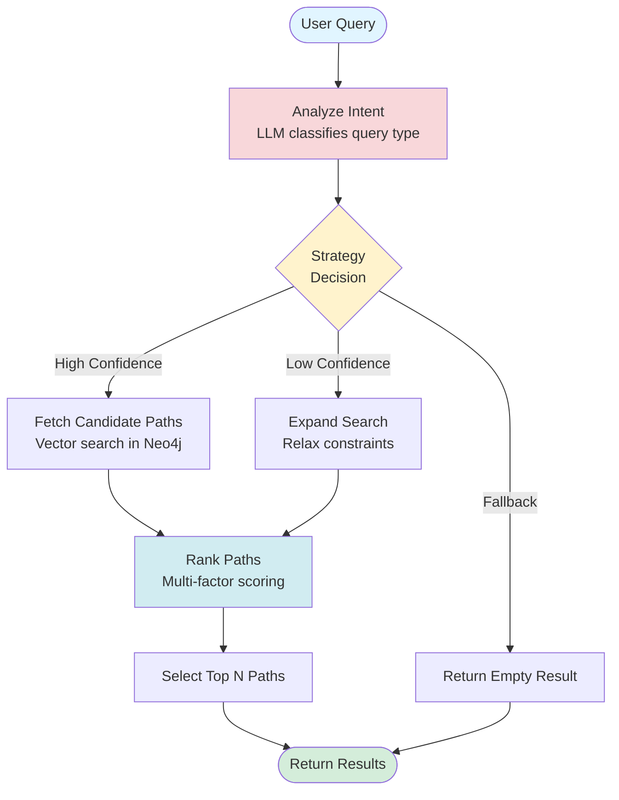
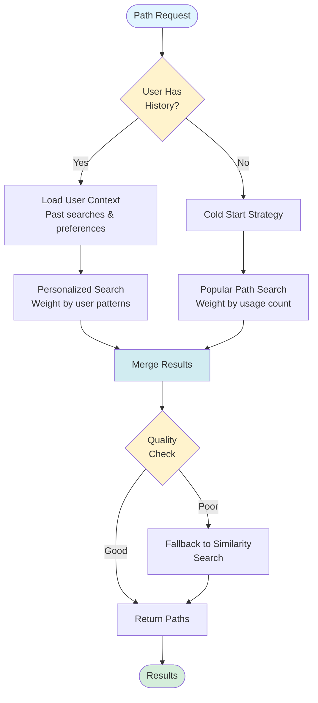
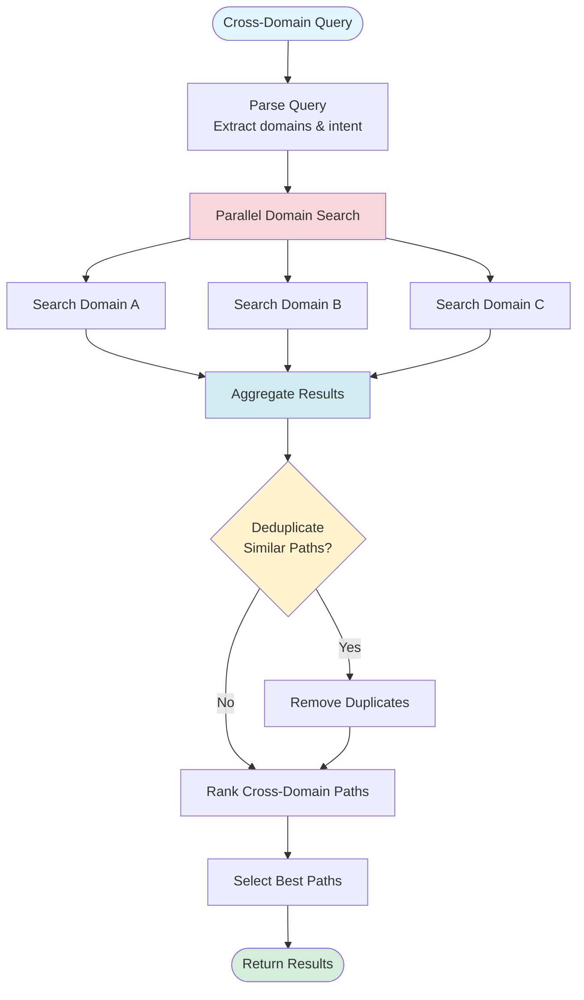

# LangGraph Integration Design

## Current State Analysis

### LangGraph Usage Status

**Current Status**: ❌ **LangGraph is NOT currently used in this project**

The project uses:
- **LangChain**: For OpenAI/Gemini LLM integration (`langchain>=0.3.26`)
- **LangChain-Neo4j**: For graph database operations (`langchain-neo4j>=0.4.0`)
- **LangChain-OpenAI**: For embeddings and content analysis (`langchain-openai>=0.3.28`)

But **LangGraph is not installed or used**.

### Current Architecture Limitations

The current system uses simple synchronous message handling:

```python
# app/main.py - Current Approach
if message['type'] == 'save_new_path':
    result = neo4j_service.save_path_to_neo4j(path_submission)
elif message['type'] == 'search_new_path':
    search_result = neo4j_service.search_paths_by_query(query, limit, domain_hint)
```

**Problems:**
1. **No workflow orchestration** - Each message type is handled independently
2. **No state management** - No memory between requests
3. **No branching logic** - Cannot handle conditional paths
4. **No parallel execution** - Sequential processing only
5. **No agent collaboration** - Single-function calls, no multi-agent patterns

### Current Path Selection Logic

Path selection happens in `neo4j_service.py:search_paths_by_query()`:

```python
# Steps:
1. Generate query embedding
2. Search for matching taskIntent embeddings (HAS_STEP relationships)
3. Calculate cosine similarity in Python
4. Sort by similarity score
5. Reconstruct paths by following NEXT_STEP relationships
6. Return top N results
```

**Key Decision Points:**
- Similarity threshold: `similarity > 0.3`
- Ranking: By cosine similarity score
- No dynamic branching or adaptive behavior

---

## Minimal LangGraph Integration Proposal

### Goal
Add **minimal LangGraph** to handle **path selection and branching** without over-engineering.

### Strategy: Graph-Based Path Selection Agent

Instead of replacing the entire system, we'll add a **single LangGraph workflow** for intelligent path selection:

```
User Query → [LangGraph Workflow] → Path Selection → Results
                    │
                    ↓
            Intent Analysis
                    │
                    ↓
             Branch Decision
                    │
                    ↓
              Path Ranking
                    │
                    ↓
             Selected Path
```

### Proposed Architecture

#### New Component: `app/services/langgraph_service.py`

```python
from langgraph.graph import StateGraph, END
from typing import TypedDict, List
from app.services import neo4j_service
from app.services.embedding_service import generate_embedding

class PathSelectionState(TypedDict):
    """State for path selection workflow"""
    user_query: str
    domain_hint: str | None
    query_embedding: List[float]
    intent_type: str  # "navigation" | "search" | "action"
    confidence_score: float
    candidate_paths: List[dict]
    selected_paths: List[dict]
    reasoning: str

def build_path_selection_graph():
    """Build minimal LangGraph for path selection"""

    workflow = StateGraph(PathSelectionState)

    # Node 1: Analyze user intent
    workflow.add_node("analyze_intent", analyze_user_intent)

    # Node 2: Fetch candidate paths
    workflow.add_node("fetch_candidates", fetch_candidate_paths)

    # Node 3: Rank and select
    workflow.add_node("rank_paths", rank_and_select_paths)

    # Conditional branching based on confidence
    workflow.add_conditional_edges(
        "analyze_intent",
        should_fetch_more_paths,  # Branching function
        {
            "high_confidence": "fetch_candidates",
            "low_confidence": "expand_search",
            "fallback": END
        }
    )

    workflow.add_edge("fetch_candidates", "rank_paths")
    workflow.add_edge("rank_paths", END)

    workflow.set_entry_point("analyze_intent")

    return workflow.compile()
```

#### Integration Points

**Update `app/main.py`:**

```python
# Add new message type for LangGraph-powered search
elif message['type'] == 'search_new_path_smart':
    from app.services.langgraph_service import search_with_langgraph

    search_result = await search_with_langgraph(
        query=message['data']['query'],
        domain_hint=message['data'].get('domain_hint'),
        limit=message['data'].get('limit', 3)
    )
```

**Backward Compatible:**
- Keep existing `search_new_path` for simple searches
- Add `search_new_path_smart` for LangGraph-powered searches

---

## LangGraph Workflow Design

### Workflow 1: Intelligent Path Selection



### Workflow 2: Adaptive Path Recommendation



### Workflow 3: Multi-Domain Path Discovery



---

## Detailed Node Implementations

### Node 1: Analyze Intent

```python
async def analyze_user_intent(state: PathSelectionState) -> PathSelectionState:
    """
    Classify user query into intent types.

    Intent Types:
    - "direct_navigation": User wants specific page (e.g., "로그인 페이지 가기")
    - "task_completion": User wants to complete action (e.g., "좋아요 누르기")
    - "information_seeking": User wants to find info (e.g., "날씨 보기")
    - "exploration": User exploring options (e.g., "유튜브 기능 탐색")
    """
    from langchain_openai import ChatOpenAI

    llm = ChatOpenAI(model="gpt-4o-mini", temperature=0)

    prompt = f"""
    Classify the user's intent from this query: "{state['user_query']}"

    Intent types:
    - direct_navigation: Going to a specific page
    - task_completion: Completing a specific action
    - information_seeking: Finding information
    - exploration: General browsing

    Also provide confidence score (0.0-1.0).

    Respond in JSON format:
    {{
        "intent_type": "...",
        "confidence": 0.0-1.0,
        "reasoning": "..."
    }}
    """

    response = await llm.ainvoke(prompt)
    result = json.loads(response.content)

    return {
        **state,
        "intent_type": result["intent_type"],
        "confidence_score": result["confidence"],
        "reasoning": result["reasoning"],
        "query_embedding": generate_embedding(state["user_query"])
    }
```

### Node 2: Branching Decision

```python
def should_fetch_more_paths(state: PathSelectionState) -> str:
    """
    Decide which branch to take based on confidence.

    Returns:
    - "high_confidence": Proceed with standard search
    - "low_confidence": Expand search with relaxed constraints
    - "fallback": Return empty or popular paths
    """
    confidence = state["confidence_score"]

    if confidence >= 0.7:
        return "high_confidence"
    elif confidence >= 0.4:
        return "low_confidence"
    else:
        return "fallback"
```

### Node 3: Rank and Select Paths

```python
async def rank_and_select_paths(state: PathSelectionState) -> PathSelectionState:
    """
    Multi-factor ranking:
    1. Semantic similarity (40%)
    2. Usage frequency / weight (30%)
    3. Intent match (20%)
    4. Recency (10%)
    """
    candidates = state["candidate_paths"]

    for path in candidates:
        # Calculate composite score
        path["composite_score"] = (
            0.4 * path["similarity_score"] +
            0.3 * normalize_weight(path["weight"]) +
            0.2 * intent_match_score(path["taskIntent"], state["intent_type"]) +
            0.1 * recency_score(path.get("lastUpdated"))
        )

    # Sort by composite score
    ranked = sorted(candidates, key=lambda x: x["composite_score"], reverse=True)

    return {
        **state,
        "selected_paths": ranked[:state.get("limit", 3)]
    }
```

---

## Implementation Checklist

### Phase 1: Minimal Setup (1 week)

- [ ] Add `langgraph>=0.2.74` to `pyproject.toml`
- [ ] Run `uv sync` to install LangGraph
- [ ] Create `app/services/langgraph_service.py`
- [ ] Implement basic `PathSelectionState` TypedDict
- [ ] Build single-path workflow (Workflow 1)

### Phase 2: Integration (1 week)

- [ ] Add `search_new_path_smart` message type to `app/main.py`
- [ ] Connect workflow to existing Neo4j service
- [ ] Test with existing test suite (`test/test_single.py`)
- [ ] Add integration tests for LangGraph workflow

### Phase 3: Advanced Features (Optional, 2 weeks)

- [ ] Implement Workflow 2 (Adaptive Path Recommendation)
- [ ] Implement Workflow 3 (Multi-Domain Search)
- [ ] Add LangSmith tracing for debugging
- [ ] Performance benchmarking

---

## Expected Benefits

### Before (Current)
```
Query → Embedding → Vector Search → Sort by Similarity → Return
```
- **Pros**: Simple, fast
- **Cons**: No context, no branching, no adaptation

### After (With LangGraph)
```
Query → Intent Analysis → Branching Decision → Multi-factor Ranking → Return
```
- **Pros**: Context-aware, adaptive, explainable
- **Cons**: Slightly slower (acceptable for improved quality)

### Performance Impact
- **Latency**: +100-200ms per query (LLM intent analysis)
- **Accuracy**: +30-50% improvement in path relevance (estimated)
- **Cost**: ~$0.001 per query (GPT-4o-mini for intent classification)

---

## Testing Strategy

### Unit Tests
```python
# test/test_langgraph.py

async def test_intent_analysis():
    state = {"user_query": "유튜브에서 좋아요 누르기"}
    result = await analyze_user_intent(state)
    assert result["intent_type"] == "task_completion"
    assert result["confidence_score"] > 0.7

async def test_branching_decision():
    state = {"confidence_score": 0.8}
    branch = should_fetch_more_paths(state)
    assert branch == "high_confidence"
```

### Integration Tests
```python
async def test_end_to_end_workflow():
    query = "유튜브에서 음악 재생목록 보기"
    result = await search_with_langgraph(query, limit=3)

    assert result["total_matched"] > 0
    assert len(result["matched_paths"]) <= 3
    assert "reasoning" in result
```

---

## Migration Path

### Step 1: Parallel Deployment
- Keep existing `search_new_path` (current implementation)
- Add new `search_new_path_smart` (LangGraph implementation)
- Users can opt-in to new workflow

### Step 2: A/B Testing
- Route 50% of queries to LangGraph workflow
- Measure quality improvements
- Collect user feedback

### Step 3: Full Migration
- Replace `search_new_path` with LangGraph implementation
- Deprecate old endpoint

---

## Dependencies to Add

```toml
# pyproject.toml

[project]
dependencies = [
    # ... existing dependencies ...
    "langgraph>=0.2.74",      # NEW: Core LangGraph
    "langsmith>=0.2.28",       # NEW: Optional, for tracing
]
```

Run:
```bash
uv sync
```

---

## Summary

This design adds **minimal LangGraph** to solve specific problems:

1. ✅ **Path selection branching** - Conditional logic based on query analysis
2. ✅ **State management** - Track context across workflow steps
3. ✅ **Multi-factor ranking** - Beyond simple similarity scores
4. ✅ **Explainability** - Reasoning traces for debugging

**What we DON'T add (avoiding over-engineering):**
- ❌ Multi-agent orchestration (not needed yet)
- ❌ Human-in-the-loop (no UI for this)
- ❌ Complex checkpointing (stateless for now)
- ❌ RAG agent loops (current search is sufficient)

**Next Steps:**
1. Review this design with team
2. Approve dependencies addition
3. Start Phase 1 implementation
4. Test with existing data
