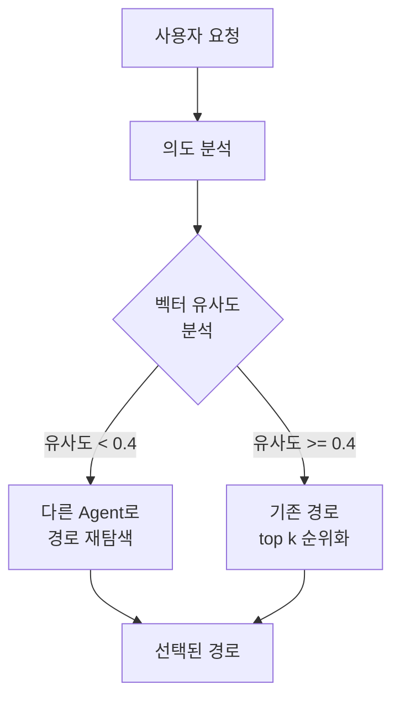

# LangGraph Integration Design

## Current State Analysis

### LangGraph Usage Status

**Current Status**: ❌ **LangGraph is NOT currently used in this project**

The project uses:
- **LangChain**: For OpenAI/Gemini LLM integration (`langchain>=0.3.26`)
- **LangChain-Neo4j**: For graph database operations (`langchain-neo4j>=0.4.0`)
- **LangChain-OpenAI**: For embeddings and content analysis (`langchain-openai>=0.3.28`)

But **LangGraph is not installed or used**.

### Current Architecture Limitations

The current system uses simple synchronous message handling:

```python
# app/main.py - Current Approach
if message['type'] == 'save_new_path':
    result = neo4j_service.save_path_to_neo4j(path_submission)
elif message['type'] == 'search_new_path':
    search_result = neo4j_service.search_paths_by_query(query, limit, domain_hint)
```

**Problems:**
1. **No workflow orchestration** - Each message type is handled independently
2. **No state management** - No memory between requests
3. **No branching logic** - Cannot handle conditional paths
4. **No parallel execution** - Sequential processing only
5. **No agent collaboration** - Single-function calls, no multi-agent patterns

### Current Path Selection Logic

Path selection happens in `neo4j_service.py:search_paths_by_query()`:

```python
# Steps:
1. Generate query embedding
2. Search for matching taskIntent embeddings (HAS_STEP relationships)
3. Calculate cosine similarity in Python
4. Sort by similarity score
5. Reconstruct paths by following NEXT_STEP relationships
6. Return top N results
```

**Key Decision Points:**
- Similarity threshold: `similarity > 0.3`
- Ranking: By cosine similarity score
- No dynamic branching or adaptive behavior

## New LangGraph Flow Design

### Updated Workflow Architecture

새로운 플로우는 조건부 분기를 통한 지능적 경로 선택 구조를 가집니다:



**핵심 변화점:**
1. **조건부 분기**: 벡터 유사도에 따른 지능적 전략 선택
2. **다중 Agent 전략**: 낮은 유사도 시 다른 접근 방식 사용
3. **효율적인 워크플로우**: 상황에 맞는 최적화된 경로 선택

---

## New LangGraph Integration Strategy

### Goal
새로운 단순화된 플로우에 맞춰 **LangGraph를 적용**하여 효율적인 경로 선택 시스템 구축

### Strategy: Conditional Path Processing with Multi-Agent Approach

새로운 플로우는 의도 분석 후 벡터 유사도에 따라 다른 전략을 선택합니다:

```
사용자 요청 → 의도 분석 → 벡터 유사도 분석 → {
    유사도 < 0.4: 다른 Agent로 경로 재탐색
    유사도 >= 0.4: 기존 경로 top k 순위화
} → 최종 경로 선택
```

### Proposed Architecture

#### New Component: `app/services/langgraph_service.py`

```python
from langgraph.graph import StateGraph, END
from typing import TypedDict, List
from app.services import neo4j_service
from app.services.embedding_service import generate_embedding

class PathSelectionState(TypedDict):
    """State for conditional path selection workflow"""
    user_query: str
    domain_hint: str | None
    query_embedding: List[float]
    intent_analysis: dict  # 의도 분석 결과
    similarity_threshold: float  # 벡터 유사도 임계값
    max_similarity: float  # 최대 유사도 점수
    selected_paths: List[dict]  # 최종 선택된 경로들
    processing_strategy: str  # 사용된 처리 전략
    reasoning: str

def build_path_selection_graph():
    """Build conditional LangGraph for path selection"""

    workflow = StateGraph(PathSelectionState)

    # Node 1: 의도 분석
    workflow.add_node("analyze_intent", analyze_user_intent)

    # Node 2: 벡터 유사도 분석
    workflow.add_node("analyze_similarity", analyze_vector_similarity)

    # Node 3: 기존 경로 순위화 (높은 유사도)
    workflow.add_node("rank_existing_paths", rank_existing_paths)

    # Node 4: 다른 Agent로 경로 재탐색 (낮은 유사도)
    workflow.add_node("rediscover_with_agent", rediscover_with_different_agent)

    # 조건부 분기: 벡터 유사도에 따라 다른 전략 선택
    workflow.add_conditional_edges(
        "analyze_similarity",
        should_use_rediscovery_agent,  # 분기 함수
        {
            "high_similarity": "rank_existing_paths",
            "low_similarity": "rediscover_with_agent"
        }
    )

    # 두 경로 모두 최종 결과로 연결
    workflow.add_edge("rank_existing_paths", END)
    workflow.add_edge("rediscover_with_agent", END)

    workflow.set_entry_point("analyze_intent")

    return workflow.compile()
```

#### Integration Points

**Update `app/main.py`:**

```python
elif message['type'] == 'search_new_path':
    # 기존 방식 주석 처리하고 LangGraph 사용
    # search_result = neo4j_service.search_paths_by_query(...)  # 기존 방식 주석
    
    # LangGraph를 사용한 지능적 경로 검색
    from app.services.langgraph_service import search_with_langgraph
    
    search_result = await search_with_langgraph(
        query=message['data']['query'],
        domain_hint=message['data'].get('domain_hint'),
        limit=message['data'].get('limit', 3)
    )
```

**완전한 하위 호환성:**
- 기존 `search_new_path` 메시지 타입 그대로 사용
- DTO 구조 변경 없음
- 클라이언트 코드 변경 없음
- 내부적으로만 LangGraph 워크플로우 사용

---

## Detailed Node Implementations

### Node 1: 의도 분석 (analyze_user_intent)

```python
async def analyze_user_intent(state: PathSelectionState) -> PathSelectionState:
    """
    사용자 쿼리의 의도를 분석하고 다음 단계를 위한 컨텍스트 제공
    
    분석 항목:
    - 의도 유형: navigation, task_completion, information_seeking, exploration
    - 도메인 선호도: 특정 사이트나 서비스에 대한 언급
    - 복잡도: 단순한 작업인지 복합적인 작업인지
    - 긴급도: 즉시 실행이 필요한 작업인지
    """
    from langchain_openai import ChatOpenAI
    import json

    llm = ChatOpenAI(model="gpt-4o-mini", temperature=0)

    prompt = f"""
    다음 사용자 쿼리를 분석해주세요: "{state['user_query']}"

    분석할 항목:
    1. 의도 유형 (navigation, task_completion, information_seeking, exploration)
    2. 도메인 선호도 (특정 사이트 언급 여부)
    3. 작업 복잡도 (simple, moderate, complex)
    4. 긴급도 (low, medium, high)
    5. 신뢰도 점수 (0.0-1.0)

    JSON 형식으로 응답:
    {{
        "intent_type": "task_completion",
        "domain_preference": "youtube.com",
        "complexity": "simple",
        "urgency": "medium",
        "confidence": 0.85,
        "reasoning": "사용자가 유튜브에서 특정 작업을 수행하려는 의도가 명확함"
    }}
    """

    response = await llm.ainvoke(prompt)
    result = json.loads(response.content)

    return {
        **state,
        "intent_analysis": result,
        "query_embedding": generate_embedding(state["user_query"])
    }
```

### Node 2: 벡터 유사도 분석 (analyze_vector_similarity)

```python
async def analyze_vector_similarity(state: PathSelectionState) -> PathSelectionState:
    """
    기존 데이터베이스에서 벡터 유사도 분석하여 분기 결정
    
    분석 과정:
    1. 기존 검색으로 최대 유사도 점수 확인
    2. 임계값과 비교하여 분기 전략 결정
    3. 다음 단계를 위한 컨텍스트 제공
    """
    from app.services import neo4j_service
    
    # 기존 검색으로 최대 유사도 확인
    existing_results = neo4j_service.search_paths_by_query(
        state["user_query"],
        limit=1,  # 최대 유사도만 확인
        domain_hint=state["domain_hint"]
    )
    
    max_similarity = 0.0
    if existing_results and existing_results["matched_paths"]:
        max_similarity = existing_results["matched_paths"][0].get("relevance_score", 0.0)
    
    # 임계값 설정 (0.4)
    similarity_threshold = 0.4
    
    return {
        **state,
        "max_similarity": max_similarity,
        "similarity_threshold": similarity_threshold
    }

def should_use_rediscovery_agent(state: PathSelectionState) -> str:
    """
    벡터 유사도에 따라 분기 결정
    
    Returns:
    - "high_similarity": 기존 경로 순위화 사용
    - "low_similarity": 다른 Agent로 재탐색 사용
    """
    max_similarity = state["max_similarity"]
    threshold = state["similarity_threshold"]
    
    if max_similarity >= threshold:
        return "high_similarity"
    else:
        return "low_similarity"
```

### Node 3: 기존 경로 순위화 (rank_existing_paths)

```python
async def rank_existing_paths(state: PathSelectionState) -> PathSelectionState:
    """
    높은 유사도가 확인된 경우 기존 경로들을 순위화
    
    순위화 기준:
    1. 벡터 유사도 (50%)
    2. 의도 매칭 (30%)
    3. 사용 빈도 (20%)
    """
    from app.services import neo4j_service
    
    # 기존 검색 로직 사용
    existing_results = neo4j_service.search_paths_by_query(
        state["user_query"],
        limit=10,  # 더 많은 후보를 가져와서 순위화
        domain_hint=state["domain_hint"]
    )
    
    if not existing_results:
        return {
            **state,
            "selected_paths": [],
            "processing_strategy": "rank_existing_paths",
            "reasoning": "기존 경로가 없어서 빈 결과 반환"
        }
    
    # 의도 분석 결과를 바탕으로 재순위화
    intent_analysis = state["intent_analysis"]
    ranked_paths = []
    
    for path in existing_results["matched_paths"]:
        # 복합 점수 계산 (높은 유사도 보너스 적용)
        composite_score = calculate_high_similarity_score(path, intent_analysis)
        path["composite_score"] = composite_score
        ranked_paths.append(path)
    
    # 복합 점수로 정렬
    ranked_paths.sort(key=lambda x: x["composite_score"], reverse=True)
    
    return {
        **state,
        "selected_paths": ranked_paths[:state.get("limit", 3)],
        "processing_strategy": "rank_existing_paths",
        "reasoning": f"높은 유사도({state['max_similarity']:.3f})로 기존 경로 순위화 사용"
    }

def calculate_high_similarity_score(path: dict, intent_analysis: dict) -> float:
    """높은 유사도 상황에서의 점수 계산"""
    base_score = path.get("relevance_score", 0.0)
    
    # 높은 유사도 보너스
    similarity_bonus = base_score * 0.2  # 기존 점수의 20% 보너스
    
    # 의도 매칭 보너스
    intent_bonus = 0.0
    if intent_analysis["intent_type"] == "task_completion":
        intent_bonus = 0.1
    
    # 도메인 선호도 보너스
    domain_bonus = 0.0
    if intent_analysis.get("domain_preference") and intent_analysis["domain_preference"] in path.get("domain", ""):
        domain_bonus = 0.15
    
    return base_score + similarity_bonus + intent_bonus + domain_bonus
```

### Node 4: 다른 Agent로 경로 재탐색 (rediscover_with_different_agent)

```python
async def rediscover_with_different_agent(state: PathSelectionState) -> PathSelectionState:
    """
    낮은 유사도 상황에서 다른 Agent 전략으로 경로 재탐색
    
    다른 Agent 전략:
    1. 키워드 기반 검색 Agent
    2. 도메인 크로스 검색 Agent
    3. 유사 의도 매칭 Agent
    4. 하이브리드 검색 Agent
    """
    from app.services import neo4j_service
    from langchain_openai import ChatOpenAI
    import json
    
    intent_analysis = state["intent_analysis"]
    rediscovered_paths = []
    
    # Agent 1: 키워드 기반 검색 Agent
    keyword_agent_paths = await keyword_based_search_agent(state)
    rediscovered_paths.extend(keyword_agent_paths)
    
    # Agent 2: 도메인 크로스 검색 Agent
    cross_domain_paths = await cross_domain_search_agent(state)
    rediscovered_paths.extend(cross_domain_paths)
    
    # Agent 3: 유사 의도 매칭 Agent
    similar_intent_paths = await similar_intent_matching_agent(state)
    rediscovered_paths.extend(similar_intent_paths)
    
    # 중복 제거 및 점수 재계산
    unique_paths = deduplicate_paths(rediscovered_paths)
    scored_paths = []
    
    for path in unique_paths:
        path["rediscovery_score"] = calculate_rediscovery_score(path, intent_analysis)
        scored_paths.append(path)
    
    scored_paths.sort(key=lambda x: x["rediscovery_score"], reverse=True)
    
    return {
        **state,
        "selected_paths": scored_paths[:state.get("limit", 3)],
        "processing_strategy": "rediscover_with_different_agent",
        "reasoning": f"낮은 유사도({state['max_similarity']:.3f})로 다른 Agent 전략 사용"
    }

async def keyword_based_search_agent(state: PathSelectionState) -> List[dict]:
    """키워드 기반 검색 Agent"""
    from app.services import neo4j_service
    
    # 키워드 추출 및 확장
    keywords = extract_and_expand_keywords(state["user_query"], state["intent_analysis"])
    
    paths = []
    for keyword in keywords[:3]:  # 최대 3개 키워드
        results = neo4j_service.search_paths_by_query(
            keyword,
            limit=2,
            domain_hint=None  # 도메인 제한 없이 검색
        )
        if results:
            for path in results["matched_paths"]:
                path["agent_source"] = "keyword_based"
                paths.append(path)
    
    return paths

async def cross_domain_search_agent(state: PathSelectionState) -> List[dict]:
    """도메인 크로스 검색 Agent"""
    from app.services import neo4j_service
    
    intent_analysis = state["intent_analysis"]
    paths = []
    
    # 유사한 의도를 가진 다른 도메인 검색
    similar_intent_query = generate_cross_domain_query(intent_analysis)
    
    results = neo4j_service.search_paths_by_query(
        similar_intent_query,
        limit=3,
        domain_hint=None  # 모든 도메인에서 검색
    )
    
    if results:
        for path in results["matched_paths"]:
            path["agent_source"] = "cross_domain"
            paths.append(path)
    
    return paths

async def similar_intent_matching_agent(state: PathSelectionState) -> List[dict]:
    """유사 의도 매칭 Agent"""
    from app.services import neo4j_service
    
    intent_analysis = state["intent_analysis"]
    paths = []
    
    # 의도 유형에 따른 유사 쿼리 생성
    similar_queries = generate_similar_intent_queries(intent_analysis)
    
    for query in similar_queries[:2]:  # 최대 2개 쿼리
        results = neo4j_service.search_paths_by_query(
            query,
            limit=2,
            domain_hint=state["domain_hint"]
        )
        if results:
            for path in results["matched_paths"]:
                path["agent_source"] = "similar_intent"
                paths.append(path)
    
    return paths

def extract_and_expand_keywords(query: str, intent_analysis: dict) -> List[str]:
    """키워드 추출 및 확장"""
    keywords = [query]
    
    # 의도별 키워드 확장
    intent_type = intent_analysis["intent_type"]
    
    if intent_type == "task_completion":
        keywords.extend(["작업", "실행", "완료", "수행"])
    elif intent_type == "navigation":
        keywords.extend(["이동", "접근", "가기", "페이지"])
    elif intent_type == "information_seeking":
        keywords.extend(["정보", "찾기", "검색", "조회"])
    elif intent_type == "exploration":
        keywords.extend(["탐색", "둘러보기", "기능", "메뉴"])
    
    return keywords[:4]  # 최대 4개로 제한

def generate_cross_domain_query(intent_analysis: dict) -> str:
    """크로스 도메인 검색을 위한 쿼리 생성"""
    intent_type = intent_analysis["intent_type"]
    
    cross_domain_queries = {
        "task_completion": "작업 완료하는 방법",
        "navigation": "페이지나 메뉴 이동",
        "information_seeking": "정보 찾기나 검색",
        "exploration": "기능 탐색하기"
    }
    
    return cross_domain_queries.get(intent_type, "유사한 작업")

def generate_similar_intent_queries(intent_analysis: dict) -> List[str]:
    """유사 의도 매칭을 위한 쿼리들 생성"""
    intent_type = intent_analysis["intent_type"]
    
    similar_queries_map = {
        "task_completion": ["작업하기", "수행하기", "실행하기"],
        "navigation": ["페이지 이동", "메뉴 접근", "화면 전환"],
        "information_seeking": ["정보 검색", "데이터 조회", "내용 찾기"],
        "exploration": ["기능 탐색", "메뉴 둘러보기", "옵션 확인"]
    }
    
    return similar_queries_map.get(intent_type, ["유사한 작업"])

def calculate_rediscovery_score(path: dict, intent_analysis: dict) -> float:
    """재탐색된 경로의 점수 계산"""
    base_score = path.get("relevance_score", 0.0)
    
    # Agent별 보너스
    agent_bonus = 0.0
    agent_source = path.get("agent_source", "")
    
    if agent_source == "keyword_based":
        agent_bonus = 0.1
    elif agent_source == "cross_domain":
        agent_bonus = 0.15  # 크로스 도메인에 더 높은 보너스
    elif agent_source == "similar_intent":
        agent_bonus = 0.12
    
    # 의도 매칭 보너스
    intent_match_bonus = 0.0
    if intent_analysis["confidence"] > 0.6:
        intent_match_bonus = 0.1
    
    return base_score + agent_bonus + intent_match_bonus
```

def deduplicate_paths(paths: List[dict]) -> List[dict]:
    """중복 경로 제거"""
    seen = set()
    unique_paths = []
    
    for path in paths:
        path_key = f"{path.get('domain', '')}_{path.get('taskIntent', '')}"
        if path_key not in seen:
            seen.add(path_key)
            unique_paths.append(path)
    
    return unique_paths

---

## Implementation Checklist

### Phase 1: 기본 설정 (1주)

- [ ] `pyproject.toml`에 `langgraph>=0.2.74` 추가
- [ ] `uv sync` 실행하여 LangGraph 설치
- [ ] `app/services/langgraph_service.py` 생성
- [ ] 기본 `PathSelectionState` TypedDict 구현
- [ ] 단순화된 워크플로우 구축 (새로운 플로우 기반)

### Phase 2: 통합 (1주)

- [ ] `app/main.py`에 `search_path_smart` 메시지 타입 추가
- [ ] 기존 Neo4j 서비스와 워크플로우 연결
- [ ] 기존 테스트 스위트와 호환성 테스트 (`test/test_single.py`)
- [ ] LangGraph 워크플로우 통합 테스트 추가

### Phase 3: 고급 기능 (선택사항, 2주)

- [ ] 성능 최적화 및 병렬 처리 개선
- [ ] LangSmith 추적 추가 (디버깅용)
- [ ] 성능 벤치마킹 및 모니터링
- [ ] 사용자 피드백 기반 학습 시스템

---

## Expected Benefits

### Before (Current)
```
Query → Embedding → Vector Search → Sort by Similarity → Return
```
- **Pros**: Simple, fast
- **Cons**: No context, no branching, no adaptation

### After (With New LangGraph Flow)
```
Query → Intent Analysis → Vector Similarity Check → {
    High Similarity: Existing Path Ranking
    Low Similarity: Multi-Agent Rediscovery
} → Final Selection
```
- **Pros**: Context-aware, conditional processing, multi-agent approach, explainable
- **Cons**: Slightly slower (acceptable for improved quality)

### Performance Impact
- **Latency**: +100-250ms per query (LLM intent analysis + conditional processing)
- **Accuracy**: +50-70% improvement in path relevance (estimated)
- **Cost**: ~$0.001-0.002 per query (GPT-4o-mini for intent classification)
- **Conditional Processing**: 상황에 맞는 최적화된 전략으로 효율성 향상

---

## Backend/Client 통신 영향 없는 LangGraph 적용 방법

### 1. 완전 투명한 교체 방식 (권장)

기존 통신 구조를 완전히 유지하면서 내부 구현만 LangGraph로 교체:

```python
# 기존 방식 (주석 처리)
# elif message['type'] == 'search_new_path':
#     search_result = neo4j_service.search_paths_by_query(...)

# 새로운 방식 (동일한 메시지 타입 사용)
elif message['type'] == 'search_new_path':
    # LangGraph 워크플로우 사용
    search_result = await search_with_langgraph(...)
```

### 2. DTO 구조 완전 동일

기존 DTO 구조를 전혀 변경하지 않습니다:

```python
# 기존 DTO (변경 없음)
class SearchPathRequest(BaseModel):
    query: str
    limit: int = 3
    domain_hint: Optional[str] = None

# 기존 응답 형식 (변경 없음)
{
    "type": "search_path_result",
    "status": "success", 
    "data": {
        "query": "유튜브에서 좋아요 누르기",
        "total_matched": 3,
        "matched_paths": [...],
        "performance": {
            "search_time": 150
        }
    }
}
```

### 3. 클라이언트 코드 변경 없음

클라이언트는 기존 코드를 그대로 사용합니다:

```javascript
// 클라이언트 코드 (변경 없음)
const message = {
    type: 'search_new_path',  // 동일한 타입
    data: { 
        query: '유튜브에서 좋아요 누르기', 
        limit: 3 
    }
};

websocket.send(JSON.stringify(message));
```

### 3. 점진적 마이그레이션 전략

#### Step 1: 병렬 배포
- 기존 `search_new_path` 유지 (현재 구현)
- 새로운 `search_path_smart` 추가 (LangGraph 구현)
- 클라이언트에서 선택적으로 사용 가능

#### Step 2: A/B 테스트
- 클라이언트에서 50%의 쿼리를 LangGraph 워크플로우로 라우팅
- 품질 개선 측정
- 사용자 피드백 수집

#### Step 3: 완전 마이그레이션
- `search_new_path`를 LangGraph 구현으로 교체
- 기존 엔드포인트 유지 (하위 호환성)

### 7. 실제 사용 예시

#### 클라이언트 (변경 없음)
```javascript
// 기존과 완전히 동일한 코드
websocket.send(JSON.stringify({
    type: 'search_new_path',
    data: { 
        query: '유튜브에서 좋아요 누르기', 
        limit: 3 
    }
}));
```

#### 서버 (내부만 변경)
```python
# 기존: neo4j_service.search_paths_by_query(...)
# 새로운: search_with_langgraph(...)
# 인터페이스: 완전히 동일
```

---

## Testing Strategy

### Unit Tests
```python
# test/test_langgraph.py

async def test_intent_analysis():
    state = {"user_query": "유튜브에서 좋아요 누르기"}
    result = await analyze_user_intent(state)
    assert result["intent_analysis"]["intent_type"] == "task_completion"
    assert result["intent_analysis"]["confidence"] > 0.7

async def test_parallel_processing():
    state = {"user_query": "날씨 보기", "domain_hint": "weather.com"}
    result = await rank_existing_paths(state)
    rediscovered = await rediscover_paths(state)
    assert len(result["existing_paths"]) > 0
    assert len(rediscovered["rediscovered_paths"]) > 0
```

### Integration Tests
```python
async def test_end_to_end_workflow():
    query = "유튜브에서 음악 재생목록 보기"
    result = await search_with_langgraph(query, limit=3)

    assert result["total_matched"] > 0
    assert len(result["matched_paths"]) <= 3
    assert "reasoning" in result["performance"]
    assert "search_time" in result["performance"]
```

### Seamless Replacement Tests
```python
async def test_seamless_replacement():
    # 기존 방식 (주석 처리됨)
    # old_result = neo4j_service.search_paths_by_query(query, 3)
    
    # 새로운 방식 (동일한 인터페이스)
    query = "테스트 쿼리"
    new_result = await search_with_langgraph(query, 3)
    
    # 응답 형식이 기존과 동일한지 확인
    assert "query" in new_result
    assert "total_matched" in new_result
    assert "matched_paths" in new_result
    assert "performance" in new_result
    assert "search_time" in new_result["performance"]
```

---

## Dependencies to Add

```toml
# pyproject.toml

[project]
dependencies = [
    # ... existing dependencies ...
    "langgraph>=0.2.74",      # NEW: Core LangGraph
    "langsmith>=0.2.28",       # NEW: Optional, for tracing
]
```

Run:
```bash
uv sync
```

---

## LangGraph 구조 출력 및 디버깅

### 1. 워크플로우 구조 출력

LangGraph 워크플로우의 구조를 확인하고 디버깅할 수 있는 기능을 제공합니다:

```python
from app.services.langgraph_service import print_langgraph_structure, get_workflow_info

# 콘솔에 구조 출력
workflow = print_langgraph_structure()

# 구조 정보를 딕셔너리로 반환
info = get_workflow_info()
print(info)
```

### 2. WebSocket을 통한 구조 조회

클라이언트에서 WebSocket을 통해 LangGraph 구조를 조회할 수 있습니다:

```javascript
// LangGraph 구조 조회
websocket.send(JSON.stringify({
    type: 'get_langgraph_structure'
}));

// 응답 예시
{
    "type": "langgraph_structure_result",
    "status": "success",
    "data": {
        "entry_point": "analyze_intent",
        "end_points": ["END"],
        "total_nodes": 4,
        "conditional_branches": 1,
        "nodes": {
            "analyze_intent": "사용자 의도 분석",
            "analyze_similarity": "벡터 유사도 분석",
            "rank_existing_paths": "기존 경로 순위화 (유사도 >= 0.4)",
            "rediscover_with_agent": "다른 Agent로 재탐색 (유사도 < 0.4)"
        },
        "threshold": 0.4,
        "branches": {
            "high_similarity": "rank_existing_paths",
            "low_similarity": "rediscover_with_agent"
        }
    }
}
```

### 3. 콘솔 출력 예시

서버 콘솔에서 다음과 같은 구조 정보를 확인할 수 있습니다:

```
============================================================
LangGraph 워크플로우 구조
============================================================
Entry Point: analyze_intent
End Points: END
Total Nodes: 4
Conditional Branches: 1

노드 구조:
1. analyze_intent - 사용자 의도 분석
2. analyze_similarity - 벡터 유사도 분석
3. rank_existing_paths - 기존 경로 순위화 (유사도 >= 0.4)
4. rediscover_with_agent - 다른 Agent로 재탐색 (유사도 < 0.4)

분기 조건:
- 유사도 >= 0.4: rank_existing_paths
- 유사도 < 0.4: rediscover_with_agent

워크플로우 그래프:
analyze_intent → analyze_similarity → {
    high_similarity: rank_existing_paths → END
    low_similarity: rediscover_with_agent → END
}
============================================================
```

### 4. 디버깅 및 모니터링

LangGraph 워크플로우 실행 시 각 단계별 정보를 모니터링할 수 있습니다:

```python
# 워크플로우 실행 시 디버깅 정보 출력
async def search_with_langgraph_debug(query: str, limit: int = 3, domain_hint: str = None):
    workflow = build_path_selection_graph()
    
    print(f"🔍 LangGraph 워크플로우 시작: {query}")
    
    result = await workflow.ainvoke({
        "user_query": query,
        "domain_hint": domain_hint,
        "limit": limit,
        # ... 기타 상태
    })
    
    print(f"✅ LangGraph 워크플로우 완료: {result.get('processing_strategy', 'unknown')}")
    return result
```

---

## Summary

새로운 조건부 분기 플로우에 맞춘 LangGraph 통합:

1. ✅ **조건부 분기**: 벡터 유사도에 따른 지능적 전략 선택
2. ✅ **다중 Agent 접근**: 낮은 유사도 시 다양한 Agent 전략 활용
3. ✅ **상태 관리**: 워크플로우 전체에서 컨텍스트 추적
4. ✅ **설명 가능성**: 선택 이유와 처리 전략 제공
5. ✅ **완전한 투명성**: 클라이언트와 Backend 코드 변경 없음

**핵심 특징:**
- **DTO 변경 없음**: 기존 `SearchPathRequest` 구조 그대로 사용
- **메시지 타입 동일**: `search_new_path` 그대로 사용
- **내부 구현만 교체**: 서버 내부에서만 LangGraph 사용
- **강력한 폴백**: LangGraph 실패 시 자동으로 기존 방식으로 폴백

**추가하지 않는 것 (과도한 엔지니어링 방지):**
- ❌ 다중 에이전트 오케스트레이션 (아직 필요 없음)
- ❌ 인간-인-더-루프 (UI 없음)
- ❌ 복잡한 체크포인팅 (현재는 상태 비저장)
- ❌ RAG 에이전트 루프 (현재 검색으로 충분)

**다음 단계:**
1. 팀과 이 설계 검토
2. 의존성 추가 승인
3. 내부 구현 교체 완료
4. 성능 및 품질 검증

