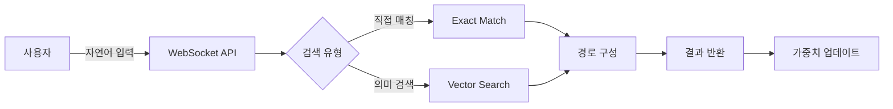
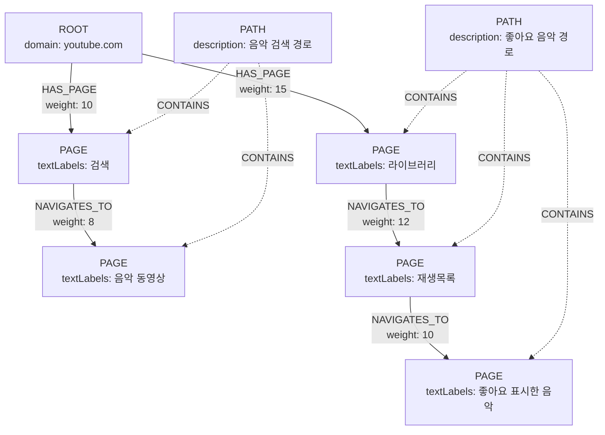

# 경로 검색 시스템 플로우 설계

## 1. 개요

사용자의 자연어 질의를 받아 가장 관련성 높은 웹 탐색 경로를 반환하는 시스템입니다.
벡터 임베딩 기반 의미 검색과 그래프 순회를 결합하여 정확한 경로 추천을 제공합니다.

## 2. 사용자 플로우

### 2.1 경로 검색 요청



**입력 예시:**
```json
{
    "type": "search_path",
    "data": {
        "query": "유튜브에서 좋아요 한 음악 재생목록 여는 방법",
        "limit": 3,
        "domain_hint": "youtube.com"  // 선택적
    }
}
```

### 2.2 검색 프로세스

#### Phase 1: 자연어 처리
1. **텍스트 임베딩 생성**
   ```python
   query_embedding = generate_embedding(query_text)
   # OpenAI text-embedding-3-small 사용
   # 1536차원 벡터 반환
   ```

2. **도메인 추출** (선택적)
   ```python
   # "유튜브", "YouTube" → youtube.com
   # "구글" → google.com
   ```

#### Phase 2: 노드 검색
1. **벡터 유사도 검색**
   ```cypher
   CALL db.index.vector.queryNodes(
       'page_embedding', 
       10, 
       $query_embedding
   ) YIELD node, score
   WHERE score > 0.7
   RETURN node, score
   ```

2. **텍스트 매칭 (Fallback)**
   ```cypher
   CALL db.index.fulltext.queryNodes(
       'page_search', 
       $query_text
   ) YIELD node, score
   ```

#### Phase 3: 경로 구성
1. **목적지에서 ROOT까지 역추적**
   ```cypher
   MATCH path = (root:ROOT)-[:HAS_PAGE|NAVIGATES_TO*]->(target:PAGE)
   WHERE target.pageId = $targetId
   RETURN path
   ```

2. **경로 점수 계산**
   ```python
   path_score = (
       vector_similarity * 0.5 +      # 의미 유사도
       (total_weight / 100) * 0.3 +   # 사용 빈도
       time_decay_factor * 0.2        # 최신성
   )
   ```

### 2.3 응답 형식

```json
{
    "type": "search_path_result",
    "status": "success",
    "data": {
        "query": "유튜브에서 좋아요 한 음악 재생목록 여는 방법",
        "matched_paths": [
            {
                "pathId": "path_abc123",
                "relevance_score": 0.92,
                "total_weight": 15,
                "last_used": "2025-01-05T10:30:00",
                "estimated_time": 12.5,
                "steps": [
                    {
                        "order": 0,
                        "type": "ROOT",
                        "domain": "youtube.com",
                        "url": "https://youtube.com",
                        "action": "YouTube 접속"
                    },
                    {
                        "order": 1,
                        "type": "PAGE",
                        "pageId": "page_123",
                        "url": "https://youtube.com",
                        "selector": "button[aria-label='라이브러리']",
                        "anchorPoint": "#guide-renderer",
                        "action": "라이브러리 클릭",
                        "textLabels": ["라이브러리", "Library"]
                    },
                    {
                        "order": 2,
                        "type": "PAGE",
                        "pageId": "page_456",
                        "url": "https://youtube.com/feed/library",
                        "selector": "tp-yt-paper-tab[aria-label='재생목록']",
                        "action": "재생목록 탭 선택",
                        "textLabels": ["재생목록", "Playlists"]
                    },
                    {
                        "order": 3,
                        "type": "PAGE",
                        "pageId": "page_789",
                        "url": "https://youtube.com/feed/library/playlists",
                        "selector": "a[title='좋아요 표시한 음악']",
                        "action": "좋아요 표시한 음악 선택",
                        "textLabels": ["좋아요 표시한 음악", "Liked Music"]
                    }
                ]
            }
        ],
        "search_metadata": {
            "total_found": 3,
            "search_time_ms": 145,
            "vector_search_used": true,
            "min_score_threshold": 0.7
        }
    }
}
```

## 3. DB 저장 플로우

### 3.1 그래프 스키마



### 3.2 새로운 PATH 엔티티 구조

```cypher
(:PATH {
    // 식별자
    pathId: "path_" + MD5(nodeSequence),
    
    // 경로 정보
    description: "유튜브에서 좋아요 한 음악 재생목록 열기",
    nodeSequence: ["root_youtube", "page_123", "page_456", "page_789"],
    startDomain: "youtube.com",
    targetPageId: "page_789",
    
    // 벡터 임베딩 (경로 전체의 의미)
    embedding: [/* 1536차원 벡터 */],
    
    // 메트릭스
    totalWeight: 15,
    usageCount: 15,
    avgExecutionTime: 12.5,  // 초
    successRate: 0.95,
    
    // 타임스탬프
    createdAt: datetime(),
    lastUsed: datetime(),
    lastUpdated: datetime()
})
```

### 3.3 경로 저장 프로세스

#### Step 1: 경로 저장 시 PATH 생성
```cypher
// 1. 기존 save_path 로직으로 노드/관계 생성
// 2. PATH 엔티티 추가 생성
MERGE (path:PATH {pathId: $pathId})
SET path.description = $description,
    path.nodeSequence = $nodeSequence,
    path.embedding = $pathEmbedding,
    path.totalWeight = 1,
    path.createdAt = datetime()

// 3. PATH와 PAGE 노드 연결
MATCH (p:PAGE) WHERE p.pageId IN $pageIds
MERGE (path)-[:CONTAINS]->(p)
```

#### Step 2: 경로 사용 시 업데이트
```cypher
// 경로가 검색되고 사용될 때마다
MATCH (path:PATH {pathId: $pathId})
SET path.totalWeight = path.totalWeight + 1,
    path.usageCount = path.usageCount + 1,
    path.lastUsed = datetime()

// 경로상의 모든 관계도 업데이트
MATCH (path)-[:CONTAINS]->(page:PAGE)
MATCH paths = (:ROOT)-[rels:HAS_PAGE|NAVIGATES_TO*]->(page)
FOREACH (rel IN rels |
    SET rel.weight = rel.weight + 1,
        rel.lastUpdated = datetime()
)
```

### 3.4 시간 기반 정리 (Monthly Cleanup)

```cypher
// 1. 30일 이상 미사용 PATH weight 감소
MATCH (path:PATH)
WHERE path.lastUsed < datetime() - duration('P30D')
SET path.totalWeight = CASE 
    WHEN path.totalWeight > 0 THEN path.totalWeight - 1
    ELSE 0
END

// 2. weight가 0인 PATH 삭제
MATCH (path:PATH)
WHERE path.totalWeight <= 0
DETACH DELETE path

// 3. 고립된 PAGE 노드 정리
MATCH (page:PAGE)
WHERE NOT (page)<-[:HAS_PAGE|NAVIGATES_TO]-()
  AND NOT (page)-[:NAVIGATES_TO]->()
  AND NOT (:PATH)-[:CONTAINS]->(page)
DELETE page
```

## 4. 벡터 인덱스 설정

### 4.1 PAGE 노드 벡터 인덱스
```cypher
CREATE VECTOR INDEX page_embedding IF NOT EXISTS
FOR (p:PAGE) ON (p.embedding)
OPTIONS {indexConfig: {
    `vector.dimensions`: 1536,
    `vector.similarity_function`: 'cosine'
}}
```

### 4.2 PATH 노드 벡터 인덱스
```cypher
CREATE VECTOR INDEX path_embedding IF NOT EXISTS
FOR (p:PATH) ON (p.embedding)
OPTIONS {indexConfig: {
    `vector.dimensions`: 1536,
    `vector.similarity_function`: 'cosine'
}}
```

### 4.3 전문 검색 인덱스
```cypher
CREATE FULLTEXT INDEX page_text_search IF NOT EXISTS
FOR (p:PAGE) ON EACH [p.textLabels]

CREATE FULLTEXT INDEX path_description_search IF NOT EXISTS
FOR (p:PATH) ON EACH [p.description]
```

## 5. 성능 최적화 전략

### 5.1 캐싱
- 자주 검색되는 쿼리의 결과를 Redis에 캐싱
- TTL: 1시간

### 5.2 배치 처리
- 경로 사용 추적은 큐에 쌓아서 배치 업데이트
- 5초마다 또는 100개 쌓이면 처리

### 5.3 인덱스 최적화
- 복합 인덱스: (domain, lastUsed, totalWeight)
- 파티셔닝: 도메인별로 데이터 분리 고려

## 6. 모니터링 지표

### 6.1 검색 품질
- 평균 relevance_score
- 클릭률 (검색 결과 중 실제 사용된 비율)
- 검색 응답 시간

### 6.2 시스템 상태
- 총 PATH 수
- 일일 활성 경로 수
- 평균 경로 길이
- 가장 인기 있는 경로 TOP 10

### 6.3 정리 효과
- 월별 삭제된 경로 수
- 스토리지 절약량
- 검색 성능 개선도