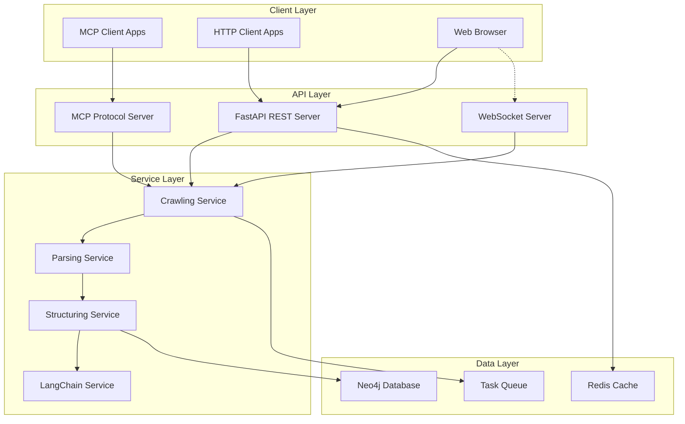
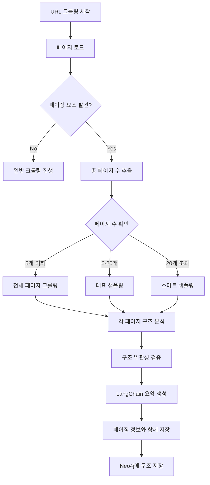
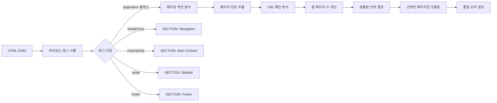

# 웹사이트 구조화 MCP 프로젝트 요구사항 명세서 (v2.2)

## 1. 프로젝트 개요

### 1.1 목적
손을 사용하기 어려운 사람들을 위해 웹사이트를 자동으로 구조화하여 효율적인 탐색을 지원하는 MCP(Model Context Protocol) 시스템 개발

### 1.2 범위
- 웹사이트 크롤링 및 구조 분석
- 계층적 데이터 구조화 및 저장
- 구조화된 데이터를 Neo4j 그래프 데이터베이스에 저장
- MCP 프로토콜 및 HTTP REST API 동시 제공 (하이브리드 아키텍처)
- 외부 클라이언트 애플리케이션을 위한 다양한 접근 방식 지원

### 1.3 기술 스택
- **웹 프레임워크**: FastAPI
- **데이터베이스**: Neo4j (그래프 DB)
- **환경 관리**: Conda
- **AI/LLM 통합**: LangChain
- **웹 자동화**: Playwright
- **HTML 파싱**: BeautifulSoup4
- **프로그래밍 언어**: Python 3.11
- **비동기 처리**: asyncio, Celery (옵션)
- **API 문서화**: OpenAPI (Swagger)

## 2. 시스템 아키텍처

### 2.1 하이브리드 아키텍처 설계



### 2.2 컴포넌트 설명

- **FastAPI Server**: HTTP REST API 엔드포인트 제공
- **MCP Server**: MCP 프로토콜 직접 구현
- **WebSocket Server**: 실시간 크롤링 진행 상황 전송
- **Service Layer**: 비즈니스 로직 처리
- **Data Layer**: 데이터 저장 및 캐싱

## 3. 기능적 요구사항

### 3.1 API 인터페이스 요구사항

#### 3.1.1 HTTP REST API (FastAPI)
- **FR-001**: RESTful API 엔드포인트 제공
- **FR-002**: OpenAPI 3.0 스펙 자동 생성
- **FR-003**: Swagger UI를 통한 대화형 API 문서 제공
- **FR-004**: JSON 요청/응답 형식 지원
- **FR-005**: 비동기 작업을 위한 백그라운드 태스크 지원

#### 3.1.2 MCP 프로토콜
- **FR-006**: MCP 표준 프로토콜 구현
- **FR-007**: JSON-RPC 형식의 메시지 처리
- **FR-008**: 양방향 통신 지원

#### 3.1.3 WebSocket
- **FR-009**: 실시간 크롤링 진행 상황 스트리밍
- **FR-010**: 구조 변경 사항 실시간 알림

### 3.2 웹사이트 크롤링
- **FR-011**: 지정된 URL의 웹페이지를 Playwright를 통해 동적으로 렌더링하고 로드
- **FR-012**: JavaScript로 생성되는 동적 컨텐츠도 완전히 로드 후 크롤링
- **FR-013**: 페이지 로드 타임아웃 설정 (기본 30초)
- **FR-014**: 크롤링 깊이 제한 설정 가능 (기본 3단계)
- **FR-015**: 비동기 크롤링 작업 큐 지원
- **FR-016**: 페이징된 콘텐츠 스마트 샘플링
- **FR-017**: Bot 감지 우회 기능 (playwright-stealth 등)
- **FR-018**: 도메인별 동시성 제어 (도메인당 1-2개 요청)
- **FR-019**: 무작위 지연 시간 및 패턴 다양화
- **FR-020**: User-Agent 및 HTTP 헤더 로테이션
- **FR-021**: 프록시 지원 (데이터센터/주거용 프록시)
- **FR-022**: 사용자 행동 모방 (스크롤, 마우스 움직임, 대기 시간)
- **FR-023**: Captcha 감지 및 실패 처리

### 3.3 구조 분석 및 추출
- **FR-024**: BeautifulSoup을 사용한 HTML DOM 구조 분석
- **FR-025**: 의미있는 섹션 자동 식별 (header, nav, main, article, section, aside, footer 등)
- **FR-026**: 각 요소의 텍스트 내용 추출 및 정제
- **FR-027**: LangChain을 통한 콘텐츠 요약 생성
- **FR-028**: 페이징된 콘텐츠의 대표 샘플링 및 구조 파악

### 3.4 데이터 구조화
- **FR-029**: 계층적 노드 구조 생성 (ROOT → SECTION → ELEMENT → CONTENT)
- **FR-030**: SUBROOT 노드 자동 식별 (base URL이 다른 경우)
- **FR-031**: 각 노드에 메타데이터 저장 (TYPE, TEXT, SUMMARY)
- **FR-032**: 노드 간 관계 설정 (HAS_SECTION, HAS_ELEMENT, HAS_CONTENT, LINKS_TO)
- **FR-033**: 페이징 정보 구조화 (총 페이지 수, 샘플링된 페이지, URL 패턴)

### 3.5 데이터 저장
- **FR-034**: Neo4j에 구조화된 데이터 저장
- **FR-035**: 중복 노드 방지 (URL 기반 unique constraint)
- **FR-036**: 증분 업데이트 지원
- **FR-037**: Redis를 통한 결과 캐싱

### 3.6 페이징 처리
- **FR-038**: 페이징 패턴 자동 감지 (?page=, /page/, offset= 등)
- **FR-039**: 총 페이지 수에 따른 적응형 크롤링 전략
- **FR-040**: 구조 동일성 검증을 통한 효율적 크롤링
- **FR-041**: 페이징된 섹션의 종합적 요약 생성

### 3.7 Bot 감지 우회 및 안전한 크롤링
- **FR-042**: playwright-stealth를 통한 자동화 탐지 우회
- **FR-043**: 도메인별 동시성 제어 (단일 도메인당 1-2개 요청)
- **FR-044**: 무작위 지연 시간 패턴 (2.5-5.5초)
- **FR-045**: User-Agent 및 HTTP 헤더 로테이션 시스템
- **FR-046**: 프록시 풀 관리 및 순환 사용
- **FR-047**: 실제 사용자 행동 모방 (스크롤, 마우스 움직임, 대기)
- **FR-048**: Captcha 감지 및 우회 불가능 시 실패 처리
- **FR-049**: 도메인별 Celery 큐 분리 및 워커 관리
- **FR-050**: 요청 실패 시 백오프 전략 구현

## 4. 데이터베이스 설계

### 4.1 노드 타입

```cypher
// ROOT 노드
(:ROOT {
  url: String,          // "https://www.naver.com"
  domain: String,       // "naver.com"
  title: String,        // "NAVER"
  created_at: DateTime,
  updated_at: DateTime
})

// SUBROOT 노드 (다른 base URL)
(:SUBROOT {
  url: String,          // "https://news.naver.com"
  parent_domain: String,// "naver.com"
  title: String,
  created_at: DateTime,
  updated_at: DateTime
})

// DEPTH 노드 (페이지 깊이 표현)
(:DEPTH {
  level: Integer,       // 1, 2, 3...
  url: String,
  title: String,
  page_number: Integer  // 페이징된 경우 페이지 번호
})

// SECTION 노드
(:SECTION {
  id: String,           // UUID
  type: String,         // "header", "nav", "main", "paginated_list" 등
  text: String,         // 실제 텍스트 내용
  summary: String,      // LangChain으로 생성된 요약
  xpath: String,        // 원본 위치
  order: Integer,       // 순서
  // 페이징된 섹션인 경우 추가 속성
  total_pages: Integer,
  sampled_pages: [Integer],
  pagination_url_pattern: String
})

// ELEMENT 노드
(:ELEMENT {
  id: String,
  type: String,         // "div", "article", "p", etc.
  text: String,
  summary: String,
  xpath: String,
  order: Integer
})

// CONTENT 노드
(:CONTENT {
  id: String,
  type: String,         // "text", "link", "image", etc.
  text: String,
  summary: String,
  xpath: String,
  order: Integer,
  href: String          // 링크인 경우
})
```

### 4.2 관계(Relationships)

```cypher
// 계층 구조
(ROOT)-[:HAS_SECTION]->(SECTION)
(ROOT)-[:HAS_SUBROOT]->(SUBROOT)
(ROOT)-[:HAS_DEPTH]->(DEPTH)
(SUBROOT)-[:HAS_SECTION]->(SECTION)
(DEPTH)-[:HAS_SECTION]->(SECTION)
(SECTION)-[:HAS_ELEMENT]->(ELEMENT)
(ELEMENT)-[:HAS_CONTENT]->(CONTENT)

// 링크 관계
(CONTENT)-[:LINKS_TO]->(ROOT|SUBROOT|DEPTH)

// 깊이 관계
(DEPTH)-[:NEXT_DEPTH]->(DEPTH)

// 페이징 관계
(DEPTH)-[:NEXT_PAGE]->(DEPTH)
(DEPTH)-[:PREV_PAGE]->(DEPTH)
```

## 5. API 엔드포인트 명세

### 5.1 HTTP REST API (FastAPI)

#### 5.1.1 크롤링 관련 엔드포인트

```python
# POST /api/v1/crawl
# 새로운 크롤링 작업 시작
{
    "url": "https://example.com",
    "depth": 3,
    "options": {
        "follow_subdomains": true,
        "timeout": 30,
        "wait_for_selectors": [".main-content"],
        "pagination": {
            "max_pages_per_section": 5,
            "sampling_strategy": "adaptive"  // "all", "first_n", "representative"
        }
    }
}

# Response
{
    "task_id": "550e8400-e29b-41d4-a716-446655440000",
    "status": "queued",
    "estimated_time": 120,
    "queue_position": 5
}
```

#### 5.1.2 상태 조회 엔드포인트

```python
# GET /api/v1/tasks/{task_id}
# Response
{
    "task_id": "550e8400-e29b-41d4-a716-446655440000",
    "status": "in_progress",
    "progress": 45,
    "current_url": "https://example.com/page2",
    "pages_crawled": 12,
    "pages_total": 27,
    "pagination_sections_found": 3,
    "started_at": "2024-01-15T10:30:00Z",
    "updated_at": "2024-01-15T10:32:15Z"
}
```

#### 5.1.3 구조 조회 엔드포인트

```python
# GET /api/v1/structure?url=https://example.com
# Response
{
    "url": "https://example.com",
    "last_crawled": "2024-01-15T10:00:00Z",
    "structure": {
        "root": {
            "url": "https://example.com",
            "title": "Example Site",
            "sections": [
                {
                    "type": "paginated_list",
                    "summary": "최신 IT 뉴스를 담은 게시판으로 총 100페이지. AI, 클라우드, 보안 등의 주제를 다루며 하루 약 50개의 새 글이 올라옴.",
                    "total_pages": 100,
                    "sampled_pages": [1, 2, 3, 100],
                    "elements": [...]
                }
            ]
        },
        "subroots": [...],
        "total_nodes": 156
    }
}
```

#### 5.1.4 탐색 경로 엔드포인트

```python
# POST /api/v1/navigate
{
    "from_url": "https://example.com",
    "target_text": "AI 최신 뉴스",
    "options": {
        "max_depth": 3,
        "prefer_accessibility": true,
        "include_paginated_content": true
    }
}

# Response
{
    "found": true,
    "path": [
        {
            "url": "https://example.com",
            "action": "시작 페이지"
        },
        {
            "url": "https://example.com/news",
            "action": "뉴스 섹션 클릭",
            "section": "header > nav",
            "element_text": "뉴스",
            "note": "100페이지의 게시판 - AI 관련 최신 글 포함"
        }
    ],
    "total_steps": 2
}
```

### 5.2 WebSocket 엔드포인트

```python
# WS /ws/crawl/{task_id}
# 실시간 크롤링 진행 상황 스트리밍

# Server -> Client (페이징 발견 시)
{
    "type": "pagination_found",
    "task_id": "550e8400-e29b-41d4-a716-446655440000",
    "url": "https://example.com/board",
    "total_pages": 100,
    "strategy": "sampling",
    "message": "100페이지 게시판 발견 - 대표 샘플링 진행"
}
```

### 5.3 MCP 프로토콜 메소드

```python
# MCP Method: crawl_and_structure
{
    "method": "crawl_and_structure",
    "params": {
        "url": "https://example.com",
        "depth": 3,
        "pagination_options": {
            "enable": true,
            "max_pages": 5
        }
    }
}
```

## 6. 페이징 처리 상세 설계

### 6.1 페이징 감지 전략

```python
class PaginationDetector:
    # URL 패턴
    url_patterns = [
        r'[?&]page=(\d+)',
        r'/page/(\d+)',
        r'[?&]p=(\d+)',
        r'[?&]offset=(\d+)',
        r'[?&]start=(\d+)'
    ]
    
    # DOM 셀렉터
    dom_selectors = [
        '.pagination',
        '.paging',
        'nav[aria-label*="page"]',
        '[class*="page-number"]',
        '.next-page',
        '.prev-page',
        '[rel="next"]',
        '[rel="prev"]'
    ]
```

### 6.2 적응형 크롤링 전략

```python
def determine_crawling_strategy(total_pages: int, content_type: str) -> dict:
    if total_pages <= 5:
        return {
            "strategy": "all",
            "pages_to_crawl": list(range(1, total_pages + 1))
        }
    elif content_type in ["news", "feed", "updates"]:
        # 최신 정보가 중요한 경우
        return {
            "strategy": "first_n",
            "pages_to_crawl": [1, 2, 3, 4, 5]
        }
    else:
        # 일반 게시판
        if total_pages <= 20:
            return {
                "strategy": "representative",
                "pages_to_crawl": [1, 2, 3, total_pages]
            }
        else:
            # 매우 많은 페이지
            return {
                "strategy": "sampling",
                "pages_to_crawl": [1, 2, 3, 10, 20, total_pages]
            }
```

### 6.3 구조 동일성 검증

```python
async def verify_structure_consistency(page1_structure, page2_structure) -> bool:
    """두 페이지의 구조가 동일한지 검증"""
    # 주요 섹션 비교
    sections1 = extract_section_types(page1_structure)
    sections2 = extract_section_types(page2_structure)
    
    # 구조 유사도 계산
    similarity = calculate_structure_similarity(sections1, sections2)
    
    return similarity > 0.9  # 90% 이상 유사하면 동일 구조로 판단
```

### 6.4 페이징 섹션 요약 생성

```python
async def create_pagination_summary(
    sampled_pages: List[dict],
    total_pages: int,
    content_samples: List[str]
) -> str:
    prompt = f"""
    다음은 총 {total_pages}페이지 중 샘플링한 내용입니다:
    
    페이지 1: {content_samples[0][:500]}
    페이지 2: {content_samples[1][:500]}
    페이지 3: {content_samples[2][:500]}
    마지막 페이지: {content_samples[-1][:500]}
    
    이 섹션의 전체적인 내용과 구조를 요약해주세요:
    1. 어떤 종류의 콘텐츠인지
    2. 주요 주제나 카테고리
    3. 업데이트 빈도 (추정)
    4. 탐색에 유용한 특징
    """
    
    return await langchain_service.summarize(prompt)
```

## 7. 시스템 플로우

### 7.1 페이징 처리를 포함한 크롤링 플로우



### 7.2 구조 분석 상세 플로우



## 8. 구현 예시

### 8.1 페이징 서비스 구현

```python
# services/pagination.py
from typing import List, Optional, Tuple
import re
from bs4 import BeautifulSoup

class PaginationService:
    def __init__(self, crawler_service, langchain_service):
        self.crawler = crawler_service
        self.langchain = langchain_service
    
    async def handle_paginated_section(
        self,
        url: str,
        soup: BeautifulSoup
    ) -> Optional[dict]:
        """페이징된 섹션 처리"""
        # 페이징 요소 찾기
        pagination_info = self.detect_pagination(soup, url)
        if not pagination_info:
            return None
        
        total_pages = pagination_info['total_pages']
        url_pattern = pagination_info['url_pattern']
        
        # 크롤링 전략 결정
        strategy = self.determine_strategy(total_pages)
        pages_to_crawl = strategy['pages_to_crawl']
        
        # 선택된 페이지 크롤링
        sampled_contents = []
        for page_num in pages_to_crawl:
            page_url = url_pattern.format(page=page_num)
            content = await self.crawler.get_page_content(page_url)
            sampled_contents.append({
                'page': page_num,
                'content': content
            })
        
        # 구조 일관성 확인
        if len(sampled_contents) >= 2:
            is_consistent = await self.verify_consistency(
                sampled_contents[0]['content'],
                sampled_contents[1]['content']
            )
            
            if not is_consistent:
                # 구조가 다르면 더 많은 페이지 샘플링
                additional_pages = self.get_additional_samples(
                    total_pages, 
                    pages_to_crawl
                )
                # ... 추가 크롤링
        
        # 종합 요약 생성
        summary = await self.create_summary(
            sampled_contents,
            total_pages
        )
        
        return {
            'type': 'paginated_list',
            'total_pages': total_pages,
            'sampled_pages': pages_to_crawl,
            'url_pattern': url_pattern,
            'summary': summary,
            'structure_consistent': is_consistent
        }
    
    def detect_pagination(
        self, 
        soup: BeautifulSoup, 
        current_url: str
    ) -> Optional[dict]:
        """페이징 요소 감지 및 정보 추출"""
        # 여러 방법으로 페이징 감지
        
        # 1. CSS 선택자로 찾기
        for selector in self.dom_selectors:
            pagination_elem = soup.select_one(selector)
            if pagination_elem:
                return self.extract_pagination_info(
                    pagination_elem, 
                    current_url
                )
        
        # 2. URL 패턴으로 찾기
        links = soup.find_all('a', href=True)
        for link in links:
            href = link['href']
            for pattern in self.url_patterns:
                match = re.search(pattern, href)
                if match:
                    return self.extract_from_url_pattern(
                        links, 
                        pattern, 
                        current_url
                    )
        
        return None
    
    async def create_summary(
        self,
        sampled_contents: List[dict],
        total_pages: int
    ) -> str:
        """LangChain을 사용한 페이징 섹션 요약"""
        # 각 페이지의 주요 내용 추출
        content_samples = []
        for sample in sampled_contents:
            soup = BeautifulSoup(sample['content'], 'html.parser')
            # 주요 텍스트 추출
            main_text = self.extract_main_text(soup)
            content_samples.append({
                'page': sample['page'],
                'text': main_text[:1000]  # 처음 1000자
            })
        
        # LangChain 프롬프트 구성
        prompt = self.build_summary_prompt(
            content_samples, 
            total_pages
        )
        
        # 요약 생성
        summary = await self.langchain.generate_summary(prompt)
        
        return summary
```

### 8.2 Neo4j 저장 구조

```python
# services/neo4j_service.py
class Neo4jService:
    async def save_paginated_section(
        self,
        parent_node_id: str,
        pagination_data: dict
    ):
        """페이징된 섹션을 Neo4j에 저장"""
        query = """
        MATCH (parent {id: $parent_id})
        CREATE (section:SECTION {
            id: $section_id,
            type: 'paginated_list',
            summary: $summary,
            text: $sample_text,
            total_pages: $total_pages,
            sampled_pages: $sampled_pages,
            pagination_url_pattern: $url_pattern,
            created_at: datetime()
        })
        CREATE (parent)-[:HAS_SECTION]->(section)
        
        // 샘플링된 페이지들을 DEPTH 노드로 생성
        WITH section
        UNWIND $sampled_pages as page_num
        CREATE (depth:DEPTH {
            level: 1,
            page_number: page_num,
            url: replace($url_pattern, '{page}', toString(page_num))
        })
        CREATE (section)-[:HAS_DEPTH]->(depth)
        
        // 페이지 간 연결
        WITH section, collect(depth) as depths
        FOREACH (i in range(0, size(depths)-2) |
            FOREACH (d1 in [depths[i]] |
                FOREACH (d2 in [depths[i+1]] |
                    CREATE (d1)-[:NEXT_PAGE]->(d2)
                )
            )
        )
        
        RETURN section
        """
        
        result = await self.session.run(
            query,
            parent_id=parent_node_id,
            section_id=str(uuid.uuid4()),
            summary=pagination_data['summary'],
            sample_text=pagination_data.get('sample_text', ''),
            total_pages=pagination_data['total_pages'],
            sampled_pages=pagination_data['sampled_pages'],
            url_pattern=pagination_data['url_pattern']
        )
        
        return result
```

### 8.3 탐색 시 페이징 정보 활용

```python
# services/navigation_service.py
class NavigationService:
    async def find_content_in_paginated_section(
        self,
        section_node: dict,
        target_text: str
    ) -> Optional[dict]:
        """페이징된 섹션에서 콘텐츠 찾기"""
        # 섹션 요약 확인
        summary = section_node.get('summary', '')
        
        # LangChain으로 관련성 판단
        relevance_check = await self.langchain.check_relevance(
            summary=summary,
            target=target_text
        )
        
        if relevance_check['is_relevant']:
            return {
                'found': True,
                'confidence': relevance_check['confidence'],
                'section_info': {
                    'type': 'paginated_list',
                    'total_pages': section_node['total_pages'],
                    'description': summary,
                    'suggestion': f"이 섹션은 {section_node['total_pages']}페이지로 구성되어 있으며, '{target_text}'와 관련된 내용을 포함하고 있을 가능성이 높습니다."
                }
            }
        
        return None
```

## 9. 비기능적 요구사항

### 9.1 성능
- **NFR-001**: 단일 페이지 처리 시간 < 10초
- **NFR-002**: 동시 크롤링 처리 가능 (최대 10개 작업)
- **NFR-003**: Neo4j 쿼리 응답 시간 < 100ms
- **NFR-004**: API 응답 시간 < 500ms (캐시된 데이터)
- **NFR-005**: WebSocket 메시지 지연 < 100ms
- **NFR-006**: 페이징된 섹션 처리 시 최대 처리 시간 < 60초

### 9.2 확장성
- **NFR-007**: 수평적 확장 가능한 아키텍처
- **NFR-008**: 플러그인 방식의 파서 추가 가능
- **NFR-009**: 로드 밸런서 호환
- **NFR-010**: 컨테이너화 지원 (Docker)
- **NFR-011**: 페이징 전략 플러그인 시스템

### 9.3 신뢰성
- **NFR-012**: 크롤링 실패 시 재시도 메커니즘 (최대 3회)
- **NFR-013**: 에러 로깅 및 모니터링
- **NFR-014**: 서킷 브레이커 패턴 구현
- **NFR-015**: 99.9% 가용성 목표
- **NFR-016**: 페이징 감지 정확도 > 95%

### 9.4 보안
- **NFR-017**: API 키 기반 인증
- **NFR-018**: Rate limiting (IP당 분당 60 요청)
- **NFR-019**: CORS 정책 설정
- **NFR-020**: SQL/Cypher 인젝션 방지

### 9.5 Bot 감지 우회 및 크롤링 안전성
- **NFR-021**: 도메인별 동시 요청 제한 (1-2개)
- **NFR-022**: 평균 요청 간격 3-4초 유지
- **NFR-023**: User-Agent 로테이션 정확도 > 99%
- **NFR-024**: 프록시 활성화 시 99% 이상 성공률
- **NFR-025**: Captcha 감지 정확도 > 95%
- **NFR-026**: 사용자 행동 모방 자연스러움 지수 > 90%
- **NFR-027**: 크롤링 차단 발생률 < 1%

## 10. 에러 처리

### 10.1 에러 타입
- **E001**: 네트워크 연결 실패
- **E002**: 페이지 로드 타임아웃
- **E003**: 파싱 실패
- **E004**: Neo4j 연결 실패
- **E005**: LangChain API 오류
- **E006**: 페이징 구조 파싱 실패
- **E007**: 페이지 수 추출 실패
- **E008**: Bot 감지 및 차단
- **E009**: Captcha 발생
- **E010**: 프록시 연결 실패
- **E011**: Rate limiting 적용됨
- **E012**: User-Agent 블랙리스트 등록

### 10.2 에러 처리 전략
```python
class ErrorHandler:
    retry_count = 3
    retry_delay = [1, 3, 5]  # 초 단위
    
    async def handle_pagination_error(self, error, url):
        """페이징 관련 에러 처리"""
        if isinstance(error, PaginationDetectionError):
            # 대체 감지 방법 시도
            return await self.try_alternative_detection(url)
        elif isinstance(error, PageCountExtractionError):
            # 기본값으로 처리
            return {'total_pages': 'unknown', 'strategy': 'first_3'}
```

## 11. 모니터링 및 로깅

### 11.1 메트릭
- 크롤링 성공/실패율
- 평균 처리 시간
- Neo4j 쿼리 성능
- 메모리 사용량
- 페이징 감지 성공률
- 평균 샘플링 페이지 수

### 11.2 로그 레벨
- **DEBUG**: 상세 크롤링 과정
- **INFO**: 주요 이벤트 (페이징 감지, 전략 결정)
- **WARNING**: 재시도, 타임아웃
- **ERROR**: 처리 실패

## 12. 보안 고려사항

- robots.txt 준수
- User-Agent 설정
- Rate limiting (특히 페이징된 콘텐츠)
- 민감 정보 필터링
- CORS 정책 준수
- 과도한 페이지 요청 방지

## 13. 향후 확장 계획

- 다국어 지원
- 이미지 OCR 통합
- 음성 피드백 연동
- 실시간 업데이트 지원
- 머신러닝 기반 구조 최적화
- Kubernetes 오케스트레이션 지원
- 동적 페이징 (무한 스크롤) 지원
- 페이징 패턴 학습 시스템